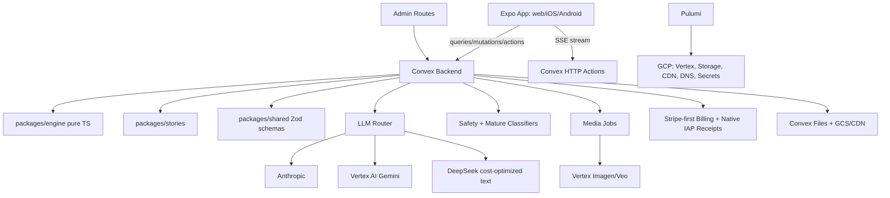

# Design Document - Core Read Loop / Full V1 App

## Overview

CYOA V1 is a guest-first, server-authoritative AI interactive-fiction app. The deterministic game engine owns all state transitions; Convex owns persistence, auth, billing, LLM orchestration, moderation, media jobs, analytics, and realtime synchronization; the Expo app renders a "living book" experience across web, iOS, and Android.

The product is designed as one coherent application rather than a demo loop. The initial path is still fast: age gate -> guest session -> tutorial -> reading view. Around that loop sit the app-critical surfaces: account claiming, daily-turn monetization, paid/pro entitlements, mature-content opt-in, co-op rooms, publishing and forking, creator seeds, seasons, endings map, trophy crypt, Pro media, native builds, operator dashboard, infrastructure, and save migrations.

Core invariants:

- The engine is pure TypeScript and has no I/O, React, Convex, LLM, billing, or provider imports.
- Convex is authoritative for every player-visible state transition.
- LLMs are content providers only; they never mutate stats, inventory, flags, nodes, endings, entitlements, age, or maturity settings.
- Safety gates run before prompting, before persistence, before publishing, and before rendering.
- Default content is general-audience. Mature content requires authenticated paid user, `ageBand = "18+"`, and explicit opt-in. Self-harm, suicide, depressive hopelessness, and player-directed despair are never allowed.
- The UI follows the design bundle's ink-on-parchment visual language, with `Read_Book` and `Stats_PeekDrawer` as defaults.

## Steering Document Alignment

### Technical Standards (tech.md)

- **TypeScript end-to-end:** Engine, shared schemas, Convex functions, Expo app, and Pulumi modules all use TypeScript.
- **Convex as reactive backend:** All saves, turns, rooms, entitlements, published tales, analytics, and assets live behind Convex queries/mutations/actions/HTTP actions.
- **Expo Router + React Native Web:** One client component tree serves web and native. Route groups map directly to `apps/app/app/*`.
- **Server-authoritative engine:** `packages/engine` computes conditions, choice application, auto-modifiers, delayed consequences, death routing, mode rules, and endings.
- **Provider router pattern:** `convex/llm/router.ts` hides Anthropic/Vertex/DeepSeek selection, fallback, retries, cost policy, and provider health.
- **Zod at trust boundaries:** Client args, LLM output, story data, generated media metadata, billing webhooks, env vars, and imported creator seeds are validated before use.
- **In-house analytics:** `analytics_events` is the only product analytics store. Admin dashboards read Convex aggregates; no third-party tracker scripts.
- **Stripe-first billing:** Stripe is the primary billing, customer portal, subscription, invoice, usage-meter, credit, and upgrade system. Native IAP is supported where app-store policy requires it and normalized into Convex entitlements.
- **Pulumi on GCP:** Infra owns Vertex AI, storage, CDN, DNS, Secret Manager, IAM, and monitoring.

### Project Structure (structure.md)

The design uses the documented monorepo layout:

- `packages/engine/`: pure game rules and executable Game Spec.
- `packages/stories/`: curated starter story data and seed fixtures.
- `packages/shared/`: Zod contracts, shared API types, analytics names, auth/env schemas, content policy schemas.
- `convex/`: server-authoritative app logic, data schema, LLM/media orchestration, auth, billing, co-op, publishing, analytics.
- `apps/app/`: Expo Router app with player, creator, account, paywall, admin, and native-compatible surfaces.
- `infra/`: Pulumi modules for GCP and deployment support.
- `design-bundle/`: reference-only design source. Production UI copies its visual language, not its prototype implementation.

## Code Reuse Analysis

### Existing Components to Leverage

- **Design bundle primitives:** `Btn`, `Choice`, `Chip`, `Bar`, `Portrait`, `Stamp`, `Divider`, `Icon`, `Img`, `Note` define the UI vocabulary. Production versions live under `apps/app/components/primitives/`.
- **Reading boards:** `Read_Book`, `Read_ModernApp`, `Read_GraphicNovel`, `Read_Journal`, `Read_Mobile` define the supported reading layouts.
- **Stats boards:** `Stats_Persistent`, `Stats_PeekDrawer`, `Stats_Contextual`, `Stats_FullSheet` define HUD modes.
- **Meta boards:** `Death_Brutal`, `Death_Bookish`, `Death_Cinematic`, endings web, trophy room, co-op lobby/turn/vote, paywall variants, and settings panel define route-level product surfaces.
- **Steering structure:** Route and module names in `structure.md` are used as target file ownership for implementation tasks.

### Integration Points

- **Convex schema:** Central integration point for accounts, saves, turns, entitlements, stories, published tales, co-op, assets, analytics, and migrations.
- **Engine package:** Convex imports engine public APIs only. Client imports engine types only.
- **Shared schemas:** `packages/shared/api` defines Convex argument/return contracts consumed by client and server tests.
- **BetterAuth:** Auth identity and account claiming integrate with Convex `accounts`.
- **Stripe/IAP:** Stripe webhooks are primary for web subscriptions, usage, credits, invoices, and plan changes. Native IAP receipts are normalized into Convex entitlements where required.
- **Anthropic/Vertex AI/DeepSeek:** Text providers are called only from Convex actions through the provider router. Vertex remains the media provider for Imagen/Veo.
- **Pulumi/GCP:** Secrets, Vertex service identity, web hosting, CDN, and monitoring are provisioned by infra.

## Architecture

### System Shape



### Turn Sequence

```mermaid
sequenceDiagram
  participant C as Client
  participant X as Convex game.beginStreamingChoice
  participant E as Engine
  participant S as Safety
  participant L as LLM Router
  participant H as HTTP Stream

  C->>X: beginStreamingChoice(saveId, choiceId, requestId)
  X->>X: auth/age/entitlement/rate/idempotency checks
  X->>E: evaluate choice + apply effects + enter next node
  E-->>X: next state + engine events + visible choices
  alt terminal/dead/safe-ended/paywall
    X->>X: persist terminal state
    X-->>C: reactive query update
  else non-terminal
    X->>X: persist pending scene + active request lock
    X-->>C: pending scene id
    C->>H: POST /llm/scene-stream(accountId, saveId, guest proof)
    H->>X: getAuthorizedSceneStreamRequest(accountId, saveId)
    X->>X: verify account/save access and current pending scene
    X-->>H: canonical SceneGenerationRequest
    H->>S: classify seeds, memory, choice labels, prompt
    H->>L: generate prose with engine-owned state
    L-->>H: streamed text tokens
    H-->>C: SSE tokens
    H->>S: classify generated prose/media metadata
    H->>X: completeSceneStream(prose, provider)
    X->>X: persist scene + turn_history + analytics, clear request lock
    alt provider/stream failure
      H->>X: failSceneStream()
      X->>X: mark scene failed and clear request lock
    end
    X-->>C: reactive query update
  end
```



### Veo image-to-video (i2v) chain (clarification to Requirement 24)

**2026-05-23 addition (commit pending):** the Imagen still and the Veo clip are no longer scheduled in parallel. `queueSceneMediaForSave` now queues only `queueSceneImage`; `runImagenJob`, after storing the live Imagen bytes via `ctx.storage.store`, chains into `queueSceneVideo` with the resulting `imageStorageId`. `runVeoJob` fetches the bytes from Convex storage, base64-encodes them, and includes them as the `image` field on the Veo `predictLongRunning` instance so the generated clip opens on the same still the reader sees in the image plate above the prose. When Imagen falls back to a placeholder (no key) or fails, video is still queued — without `imageStorageId` — so Veo runs text-only and the reduced-motion / placeholder fallback continues to produce a clip.

**2026-05-23 dedup (commit pending):** `completeSceneStream` previously also called `queueSceneVideo` directly in parallel with `queueSceneImage` (no `imageStorageId`), so every scene incurred two Veo jobs — one text-only racing Imagen and the proper i2v chain — doubling Veo spend and burning through the free-tier 10-RPD `veo-3.1-lite-generate-preview` quota twice as fast. The duplicate call is removed; all Veo queueing flows exclusively through the post-Imagen chain in `runImagenJob` (or the text-only fallback inside that chain when Imagen is unavailable).

This is per-scene first-frame conditioning only. Cross-scene visual continuity (character / lighting carry-over via `referenceImages`) requires the full or fast `veo-3.1-generate-preview` model — the current `veo-3.1-lite-generate-preview` does not accept `referenceImages`. That step-up is deferred for a separate cost / design pass.

### Free-form Choice ("Option D") (clarification to Requirement 5)

**2026-05-23 addition (commit pending):** the reader can type their own action instead of selecting one of the three LLM-proposed choices. The UI affordance is a 4th row in `ChoiceList` ("Write your own…") that expands inline into a text input. The mutation under the hood is the same `game.beginStreamingChoice`, but with two additions:

- **Synthetic `choiceId`** — the client sends `choiceId: "freeform:<requestId>"`. The engine receives this id but does not look it up in the prior proposal's choice list (see the `freeform: true` branch in `engine.advanceLlmTurnCursor`). No engine effects are applied — the reader wrote their own action, so there are no proposed `effects[]` to honor.
- **`userText` payload** — the trimmed text (1–200 chars) is sent alongside the choiceId. Convex runs `evaluateTextPolicy` on it in the `publishing` surface (matches the creator-seed flow's treatment of user-typed content, so a block is a hard block and not a `safe_end`), persists it to `turn_history.choiceLabel`, and the next-scene memory beat reads as `from <node> chose "<typed text>" → entered <next>` instead of an opaque synthetic id.

The free-form path is **not** tier-gated — it's available to every reader on every LLM-driven save. It is rejected for scripted / local-engine stories (`AppError("freeform_not_supported_for_story")`) because the deterministic engine needs a known edge id to apply scripted effects. Length and safety errors surface as specific AppError codes (`freeform_text_empty | freeform_text_too_long | freeform_text_blocked`) that the client maps to copy in the in-book voice — never raw codes, never stack traces.

### Seed-an-Adventure end-to-end plumbing (clarification to Requirement 22)

**2026-05-23 addition (commit pending):** before this fix, `SeedStoryFlow` collected starter + title + premise + tone from the reader but only the `starterId` reached the server — the typed premise was persisted to localStorage as a draft and never threaded to the LLM. Readers landed in the starter's content (typically `training-room`, the first entry in `starters[]`) regardless of what they typed. The end-to-end plumbing now flows:

1. **UI** — `SeedStoryFlow.tsx` `onLaunchStarter` prop is now `({ starterId, title, premise, tone }) => Promise<void>` (was `(starterId) => Promise<void>`). `apps/app/app/creator/index.tsx` calls `library.createSave(starterId, "story", title, narrator.voiceId, { premise, title, tone })`.
2. **Hook** — `useLibrary.createSave` accepts an optional `seed?: { premise?; title?; tone? }` arg, uses `seed.title` as the local save title when present, and threads the object to `createRemoteSave`.
3. **API** — `apps/app/lib/gameApi.ts:createRemoteSave` gains optional `seedPremise`/`seedTitle`/`seedTone` string fields.
4. **Server** — `convex/game.ts:createSave` accepts the three new args, runs `evaluateTextPolicy({ surface: "publishing" })` on the trimmed `seedPremise` (block → hard `seed_premise_blocked` AppError — same surface as the free-form choice flow, so a safety hit is a hard block rather than a `safe_end`), and persists the fields on the save record via `cleanDoc` + conditional spread.
5. **Schema** — `convex/schema.ts` `saves` table and `convex/saves.ts:SaveRecord` both gain `seedPremise: v.optional(v.string())`, `seedTitle: v.optional(v.string())`, `seedTone: v.optional(v.string())`.
6. **LLM** — `beginStreamingChoice`, `runLlmDrivenBeginStreaming`, and `runLlmDrivenSubmitChoice` prefer `save.seedPremise` over `startNode?.seed`, `save.seedTitle` over `story.title`, and `save.seedTone` over `summary?.tone` when present.

The starter still provides the engine skeleton (initial state, nodes, endings, safety profile, media policy); only the *narrative* values — premise, title, tone — are overridden by the reader's typed input, so engine determinism is preserved.

### NPCs and Companions (design for Requirement 31)

**2026-05-24 addition (future feature, no code yet):** today's `PlayerState` (see `packages/engine/src/state.ts`) carries `vitality`, `currency`, `attributes`, `inventory`, and `flags` only — there is no concept of a named, persistent non-player character. Requirement 31 introduces NPCs and companions as a first-class engine concern. The design holds the existing invariants (engine owns mutation, LLM proposes prose + choices, prompt builder surfaces only what the next turn needs) and extends each layer rather than bolting on a parallel system.

**Engine state extension.** `PlayerState` gains an optional `npcs: Record<string, NpcState>` field. `NpcState` is shaped as:

```
{
  id: string;
  name: string;
  role: "companion" | "ally" | "rival" | "neutral" | "antagonist";
  disposition: number;            // signed scalar, engine-clamped
  location?: string;              // scene/node id the NPC is currently in
  attributes: Record<string, Stat>;
  inventory?: Item[];
  knownFacts: string[];
  relationships?: Record<string, number>; // other npcId → signed scalar
  flags: Record<string, boolean | number>;
}
```

The engine `schemaVersion` increments by one. `migrateEngineState` adds an empty `npcs: {}` to any legacy state on load so the field is always defined. The Convex `saves` table stores `state` as a JSON column, so its shape does not change and no Convex schema bump is required beyond the engine version bookkeeping that `runMigrations` already handles.

**LLM contract (consistency with Requirement 9).** The same guard that prevents an LLM proposal from mutating `PlayerState` directly applies to `npcs`: the proposal carries prose, choices, and effect references but never a literal state patch. The proposal schema gains one optional field, `npcMentions: string[]`, which is purely presentational/anchor metadata — the engine reads it only to decide which NPC sheets to surface in the *next* prompt. All NPC mutations flow through engine-authored effects validated by `applyChoiceAndEnterNode`:

- `npc_spawn` — registers a new `NpcState` in `state.npcs`.
- `npc_despawn` — removes by id.
- `npc_relocate` — sets `location`.
- `npc_disposition_delta` — signed adjust, engine-clamped.
- `npc_attribute_delta` — same `Stat` math the player uses.
- `npc_inventory_add` / `npc_inventory_remove` — symmetric with player inventory effects.
- `npc_flag_set` — boolean/number flag set.
- `npc_learn_fact` — appends to `knownFacts` (deduped).

**Prompt-builder changes.** When `convex/llm/prompts/scene.ts` builds the scene prompt, it includes a compact NPC sheet for each NPC whose `location` matches the current scene OR who appears in the last 3 turns of the memory window. The sheet is deliberately tight: `name`, `role`, `disposition` mapped to a one-word vibe (`friendly` / `wary` / `hostile`), top 3 `knownFacts`, and visible attributes only — hidden attributes are stripped the same way the existing "Player state summary" pattern hides them. At most 5 NPCs are surfaced per turn (priority order: currently-present, then most-recently-mentioned). A chatty cast otherwise bloats every prompt token, which directly hits LLM cost and latency on a per-turn surface.

**Choice schema extensions.** Authored choice effects MAY declare `requiresNpc: <npcId>`; `evaluateNodeChoices` filters such choices out when the named NPC is not in the current scene, the same way it already hides choices that fail a flag or item gate. An optional `targetNpc: <npcId>` is passed to the LLM as a presentational hint so the proposal text can read as "this choice acts on Mira" rather than ambient. The existing `skill_check` effect gains an `includeCompanions: true` option: when set, the check aggregates attribute values from every NPC with `role: "companion"` into the roll alongside the player's own stat.

**Conversation surface.**

- **v0** reuses the free-form "Option D" path already shipped (see the section above). The reader types "ask Mira where the lantern came from", the prompt builder has already included Mira's sheet because she is in the current scene, and the LLM responds in character. No new UI, no new mutation, no engine change beyond the prompt-builder additions.
- **Phase 2 (stretch)** is a dedicated "Talk to &lt;NPC&gt;" choice variant. Selecting it opens a focused turn loop where the next scene is constrained to dialogue with that NPC and at most one `npc_*` effect, with an always-present "End conversation" choice. Implementation-wise this is a prompt-mode flag on the proposal request — no schema change, no new mutation surface.

Both surfaces consume the same daily-turn allowance and run `evaluateTextPolicy({ surface: "publishing" })` on any typed text, matching the free-form choice and seed-premise treatment.

**Authored seed integration.** Starter story definitions (see `packages/stories/src/*/`) MAY include an `initialNpcs: Record<string, NpcState>` block. `createInitialState` merges it into the initial `PlayerState.npcs` when present. The "Seed an adventure" creator UI explicitly does NOT include an NPC roster builder in v0 — this is out of scope and documented as a future iteration. Readers writing free-form premises CAN describe characters in prose; the LLM will introduce them organically, and the engine's first `npc_spawn` effect (proposed by the LLM via the new presentational metadata and lifted by an engine adapter on first mention) is the v0 mechanism for getting authored-by-the-reader characters into `state.npcs`.

**Co-op interaction.** `coop_rooms` is human-to-human; NPCs are state-driven AI actors. The two coexist cleanly — a save with two human readers can also have a companion NPC. Vote mode arbitrates only the human choices, and the participating-human-count check is not affected by NPC count.

**Data flow (mirrors the Seed-an-Adventure step list).**

1. **Seed** — authored `initialNpcs` (or none) land in `state.npcs` via `createInitialState`.
2. **Surface** — `convex/llm/prompts/scene.ts` selects up to 5 relevant NPCs and emits their compact sheets into the scene prompt.
3. **Propose** — the LLM returns prose, choices, and optional `npcMentions[]`. No direct state patch.
4. **Resolve** — `applyChoiceAndEnterNode` walks the selected choice's authored effect list, executing any `npc_*` effects; an engine adapter also lifts first-mention `npcMentions` into a synthesized `npc_spawn` when no matching `npcs[id]` exists yet.
5. **Persist** — the updated `state.npcs` is part of the next save patch alongside player state.
6. **Remember** — the memory window includes recent NPC mentions so the LLM keeps continuity across turns.
7. **Repeat** — subsequent prompts re-fetch the relevant subset; NPCs not in scene and not recently mentioned drop out of the prompt automatically.

**Out of scope for v0.**

- Persistent NPC backstory authoring tools (no creator UI for rosters).
- NPC-vs-NPC interactions outside what the LLM proposes in prose.
- Cross-save NPC roster persistence — each save owns its own `state.npcs`.
- Cinematic and portrait media for NPCs — Pro media remains scene-level only in v0.

### Story Arc Beats (design for Requirement 32)

**2026-05-24 addition (future feature, no code yet):** the engine today has no notion of "this story must include moment X before it can end". An LLM-driven save can drift into an ending that skips the authored climax, or a vitality-zero death can fire before the protagonist ever meets the antagonist. Requirement 32 introduces *arc beats* — declared narrative milestones — and a two-pronged enforcement model: a per-turn soft nudge in the prompt and a hard gate at terminal time. The split keeps normal turns flexible (the LLM is never told it *must* surface a beat right now) while making ending-skipping impossible without engine cooperation.

**Data model.** `ArcBeat` lives in `packages/engine/src/state.ts` alongside the Story types:

```
ArcBeat = {
  id: string;
  name: string;                    // short label for tooling / logs
  description: string;             // prose-level intent for the LLM
  requiredBefore?:
    | { kind: "ending" }
    | { kind: "endingId"; endingId: string }
    | { kind: "death" }
    | { kind: "turn"; turnNumber: number };
  priorityHint?: "early" | "mid" | "late";
}
```

`Story` gains an optional `arcBeats?: ArcBeat[]`. `PlayerState` gains `completedArcBeats: Record<string, { completedAt: number; turnNumber: number }>` and `forcedBeatTurn: boolean` (defaults `false`). The LLM proposal schema gains an optional `arcBeatCompletions: string[]` — presentational only, mirroring the `npcMentions` pattern from Requirement 31. A derived helper `pendingArcBeats(story, state)` returns beats not yet in `completedArcBeats`, used by both the prompt builder and the terminal gate. The engine `schemaVersion` increments by one; `migrateEngineState` injects the two missing fields into legacy snapshots so existing saves continue to load.

**Soft nudge (every turn).** When `convex/llm/prompts/scene.ts` builds a scene prompt for an LLM-driven story, it inserts a "Pending arc beats" section listing the top 3 highest-priority pending beats by `priorityHint` order (`early` → `mid` → `late`, tiebroken by declaration order). Each entry is `name` + `description` only. The directive is explicitly soft: "if narratively appropriate this turn, aim to surface one of these — you are not required to". Cap at 3 to keep the prompt tight; a story with 12 beats does not balloon every prompt. When the LLM returns `arcBeatCompletions: string[]`, the engine validates each id against the active story's `arcBeats[].id`, silently drops unknowns, and appends valid ids to `state.completedArcBeats` with the current `turnNumber` and timestamp.

**Hard gate (terminals).** Whenever a terminal is about to fire — vitality drops to 0, an authored ending scene is reached, or the LLM proposes a `terminal` field — the engine first calls `pendingArcBeats(story, state)` and filters to beats whose `requiredBefore.kind` matches the imminent terminal. `{ kind: "ending" }` blocks any non-safe ending. `{ kind: "endingId", endingId: "ending-cathedral" }` blocks that specific ending only. `{ kind: "death" }` blocks a vitality-zero death. If any matching pending beats remain, the engine rejects the terminal with an `arc_beats_pending` AppError, sets `state.forcedBeatTurn = true`, and forces another scene. The next prompt prepends a stronger directive: "Required before ending: <pending beat name(s) + description(s)>. Surface this beat now." The `forcedBeatTurn` flag clears once the next valid proposal lands. If the LLM successfully surfaces the beat (via `arcBeatCompletions`) and the terminal would now satisfy the gate, the terminal fires on the following turn.

**Turn-bound beats (soft warning).** A beat with `requiredBefore.kind === "turn"` is a "should have surfaced by now" warning rather than a hard gate. When `state.turnNumber >= requiredBefore.turnNumber` and the beat is still pending, the engine sets `forcedBeatTurn = true` on the next prompt (one-turn warning). On the turn after that, the engine SHALL still allow the LLM to proceed even if the beat was not surfaced — only ending/death/endingId beats block terminals.

**Compatibility with NPCs (Requirement 31).** An arc beat MAY describe an NPC moment ("Mira reveals her true allegiance to the Iron Court"). The engine does NOT enforce NPC presence as part of beat validation — that is the prompt builder's job. When the pending-beats section is rendered, the existing NPC-sheet selector (Requirement 31.3) already surfaces NPCs in scope, so a beat referencing "Mira" composes naturally with Mira's sheet if she is currently present. If she is not in scope, the LLM may relocate her in prose (subject to engine-authored `npc_relocate` effects on the resulting choice), or wait for a later turn. Neither system reaches into the other.

**Compatibility with Seed-an-Adventure (Requirement 22.7).** Open-premise saves launched through the Seed-an-Adventure flow inherit no arc beats by default — the starter's `arcBeats` array is replaced by `[]` when the reader-typed premise overrides the starter's seed, since the authored beats were tied to the starter's authored arc. A future iteration MAY let the reader author a 3-beat sketch as part of the seed flow (matching Requirement 31.7's NPC-roster-builder deferral); explicitly out of scope for v0.

**Failure modes.** If the LLM ignores the soft nudge indefinitely on normal turns, nothing forces the issue — soft is soft. Only terminals trigger the hard gate. A reader who never reaches a terminal can leave beats pending forever, and that is by design (a slow-burn save in the middle of a story has not yet earned its ending). The only failure mode that produces a visible "stuck" state is a misauthored beat whose required-before condition can never be satisfied (e.g. `requiredBefore.endingId` pointing at an ending that no choice path can reach); Task 63's story validator catches this at story-load time.

**Out of scope for v0.**

- Reader-authored arc-beat sketches in the Seed-an-Adventure flow.
- A creator-side beat editor surface (no UI; beats are declared in code).
- Cross-save beat persistence — each save owns its own `completedArcBeats`.
- Adaptive beat selection based on reader behavior (the top-3 selector is deterministic by priority).

### Running story summary (design for Requirement 33)

**2026-05-24 addition (commit pending):** the memory window already feeds the LLM a verbatim transcript of the last N turns (`loadMemoryWindow` in `convex/game.ts`), which gives the model recent texture but no canonical state. On a long save the window slides off the early turns entirely — the LLM forgets the protagonist already opened the coconut and proposes opening it again, since "opened coconut" was 12 turns ago and fell off the window. Requirement 33 fixes this with a parallel, non-blocking summarizer that maintains a running ~500-char canonical-state breadcrumb on the save record and surfaces it in every scene prompt above the memory window.

**Data flow.** `save.storySummary?: string` (new field on the `saves` table, mirrored in `SaveRecord`) holds the most recent summary. The flow per turn:

1. **Turn completes** — `completeSceneStream` finalizes the scene, persists the prose + effects, and returns to the client (the user-visible read loop is unblocked at this point — the summarizer never holds up the return).
2. **Schedule summarizer** — same action schedules `summarizer.regenerate({ saveId })` via `ctx.scheduler.runAfter(0, ...)` (parallel, fire-and-forget pattern matching `queueSceneImage` from Requirement 24).
3. **Summarizer runs** — `convex/llm/summarizer.ts` loads the prior summary + just-completed scene prose + the latest engine effects, calls the provider router with a tight system prompt that emits canonical-facts-only prose (named NPCs, current location, key inventory, established world facts, completed beats; drop weather, mood, single-line dialogue beats that did not change state), truncates at the last sentence boundary ≤500 chars, and persists via a mutation atomically.
4. **Next prompt surfaces** — `convex/llm/prompts/scene.ts` reads `save.storySummary` and inserts a `Story so far: <summary>` block ABOVE the memory window and BELOW the player-state snapshot + NPC-sheet sections. The model now sees canonical state first, recent texture second.

**Failure-safe.** The summarizer is best-effort. Provider error, parse error, safety block, network timeout — all swallowed. The prior `storySummary` value remains untouched (never blanked because of a transient hiccup) and a redacted `summarizer_failed` metric is emitted for the operator dashboard. A save can run for hundreds of turns with a stale summary and still function; the summary is a quality improvement, not a correctness gate.

**Relationship to the memory window.** Memory = recent texture (the LLM's short-term sensory feed of the last N turns' prose). Summary = canonical state (the LLM's long-term factual ground truth). The two serve different purposes and are deliberately separate: summary is concise + drift-corrected by re-derivation every turn; memory is verbatim + slides naturally with time. They compose. A turn 50 prompt contains the summary ("Mira and the protagonist are camped in the Bone Cathedral's lower crypt. Mira carries the Iron Key. The lantern was lit at turn 38 and remains lit.") plus the last 3-5 turns of full prose. The model never has to guess at canonical facts because the summary always restates them.

**Cost rationale.** The summarizer adds one LLM call per turn at a cheap-tier price point (a ~500-char synthesizer prompt on the cost-optimized DeepSeek slot from Requirement 5, or Vertex Gemini fallback). Per-turn cost increase is single-digit-percent of the scene-generation call. The scene-generation call itself gets cheaper at the margin because the prompt no longer needs to defensively re-include far-back facts.

**Out of scope for v0.**

- Summary versioning / rollback — only the latest summary is stored.
- Reader-visible summary surface — the summary is a prompt-builder concern, not a reader-facing UI element.
- Summary diff display in the operator dashboard — only the failed-call counter is surfaced.

### Stat-change narration (design for Requirement 34)

**2026-05-24 addition (commit pending):** today the engine echoes structured stat changes (`deriveEngineEcho` / `deriveRemoteEcho` in `apps/app/hooks/useTurn.ts`) into a one-line string the projection carries, but the prose itself doesn't always narrate the cause. The reader sees vitality drop −1 while the prose describes a scenic vista, with no in-world reason given for the loss. The same gap exists for currency, attributes, and inventory. Requirement 34 fixes this on two surfaces simultaneously: a strengthened prompt rule that makes cause-narration mandatory, and a new `<EffectBadge>` UI component that surfaces the most recent change inline near the prose so the reader can correlate prose ↔ numbers without scanning the HUD.

**Prompt-level (rule 7 strengthening).** `convex/llm/prompts/scene.ts` rule 7 is rewritten from a soft "you may narrate stat changes" to a mandatory "the prose MUST narrate the cause of any stat, currency, or inventory change that the engine applies this turn." The directive is paired with concrete examples: "if vitality drops, the prose must surface the in-world reason (injury, hunger, fatigue, poison); if currency rises, the prose must surface the transaction or find that produced it; if an inventory item appears, the prose must show the reader receiving it." This is a behavioral nudge, not a structural enforcement — the LLM may still produce a turn that fails the directive, and the engine does not reject such turns (rejecting on a soft-content rule would create infinite-retry loops). The UI-level `<EffectBadge>` (below) gives the reader a visible signal even when the LLM under-narrates.

**UI-level (`<EffectBadge>` component).** New `apps/app/components/reading/EffectBadge.tsx`. Renders a single inline pill: tone-colored fill + glyph + short label + delta. Tone color mapping (uses semantic aliases from Requirement 30.2, never hex literals):

| Direction | Token alias  | Use                                              |
|-----------|--------------|--------------------------------------------------|
| positive  | `success`  | vitality gain, currency gain, attribute up       |
| negative  | `danger`   | vitality loss, currency loss, attribute down     |
| neutral   | `candleSoft` | inventory swap (no count change), flag set     |

The badge is sized for inline reading — not a chrome element, not competing with prose. Per-layout placement:

- `Book` — inline within the prose column, immediately after the paragraph that triggered the change (or trailing the scene if the change spans multiple paragraphs).
- `Journal` — inline, journal-margin-aligned with the existing pip animation.
- `GraphicNovel` — floating near the stat-HUD frame, mirroring the existing chip rail.
- `ModernApp` — floating with stat-HUD, app-card treatment.
- `Mobile` — thin strip immediately above the choice list, full-width.

`prefers-reduced-motion` (Requirement 18.5, NFR Usability) renders the badge as a static block with no animation; otherwise it uses the same brief candle-flicker entry the existing stat-pip uses (~120ms, well under the 100ms pip-latency budget for visual update, since the animation overlaps with the pip).

**Data plumbing (no schema change).** `apps/app/hooks/useTurn.ts` already projects an `echo` string into the turn projection via `deriveEngineEcho` (engine path) and `deriveRemoteEcho` (LLM path). The hook is extended to also project a structured `recentEffect?: { kind: "vitality" | "currency" | "attribute" | "inventory" | "flag"; label: string; delta?: number; tone: "positive" | "negative" | "neutral" }` derived from the same source data (engine diffs for the engine path; the LLM scene's effect array for the remote path). No new server-side state, no schema change, no Convex round-trip — this is a pure client-side projection of data the hook already receives. Layouts consume `recentEffect` (when defined) and render `<EffectBadge>` at the per-layout placement above.

**Failure modes.**

- Multi-effect turn (e.g. vitality −1 AND inventory +Iron Key on the same turn) — the projection surfaces ONE badge for the most significant change (priority: vitality > currency > attribute > inventory > flag). The other effects still appear in the stat-HUD's full sheet (Requirement 6.4); the badge is a recent-change focus, not a full inventory.
- LLM under-narrates despite the strengthened rule 7 — the badge surfaces the engine truth regardless, so the reader is never confused about WHAT changed even if WHY is muddy. This is the structural backstop for the soft prompt rule.
- Reduced-motion + dense effect turns — badge persists for the full turn duration (no fade), so a reader scanning a static page still sees the change.

**Out of scope for v0.**

- Per-effect badge stack (only the most significant is surfaced).
- Reader-tunable badge placement (per-layout is fixed).
- Per-NPC effect badges (NPC stat changes from Requirement 31 are surfaced via the NPC roster row, not via `<EffectBadge>`).

### Reference image anchors (design for Requirement 35)

**2026-05-24 addition (commit pending):** today every scene image is a fresh text-to-image call (`runImagenJob` in `convex/media/sceneMedia.ts` → Imagen 4 fast on Vertex). The protagonist in scene 1 has nothing in common visually with the protagonist in scene 5 because each call only sees the scene's text prompt — there is no shared visual seed. The Veo i2v chain (Requirement 24.2a) keeps the video locked to the still it received, so per-scene first-frame consistency is solved, but across-scene character + setting consistency is not. Requirement 35 fixes this by switching the primary scene-image path to Gemini 2.5 Flash Image (a multi-modal model that accepts prior images as references) and persisting two anchor images per save — a protagonist portrait and a setting establishing shot — generated at turn 1 and passed as `inline_data` references on every subsequent scene's image call.

**Model choice rationale (Gemini 2.5 Flash Image vs Vertex Imagen customization).** Two viable paths exist for reference-conditioned image generation: Vertex Imagen's reference-image / customization endpoints, or Gemini 2.5 Flash Image's multi-modal stateless-with-context pattern. Gemini wins for this project because:

- **Single API surface.** Both the LLM (text generation) and the image generator live on the Google Generative Language API surface today; one auth path, one rate-limit pool to monitor, one SDK in `convex/llm/` and `convex/media/`. Adding Vertex customization means a second auth path (OAuth-scoped service account vs API key), a second quota system, and a second client wrapper.
- **No OAuth dependency.** Gemini Flash Image uses the same API-key auth as the existing Gemini text path. Vertex Imagen customization requires OAuth-scoped service-account credentials, which adds a Secret Manager surface this project hasn't needed and would slow the iteration loop.
- **Stateless-with-context.** Each Gemini Flash Image call is independent — pass the references as `inline_data` parts each call, model produces the new image. No fine-tune step, no model-version pinning per save, no customization-job to monitor. This matches the per-turn turn-loop pattern the rest of the media pipeline uses.
- **Cost shape.** Gemini Flash Image bills per-call without a customization training fee; Vertex customization has a per-fine-tune cost that would amortize poorly for a per-save anchor pair.

The trade-off: Gemini Flash Image is newer (preview-tier) and may have stricter rate limits than Imagen 4 fast. The fallback path (Imagen 4 fast text-only) is preserved end-to-end so a Gemini outage or quota exhaust degrades to today's behavior, not a broken read loop.

**Two-anchor pattern (protagonist + setting).** The minimum viable anchor set is two images: a portrait of the protagonist (face, clothing, signature props) and an establishing shot of the world's signature setting (architecture, mood, color palette, distinctive geography). Together they pin the two visual dimensions the reader most notices drifting: WHO and WHERE. Additional anchors (NPC portraits per Task 52d, scene-specific props) are out of scope for v0 — the NPC portrait pipeline already exists at the roster level (Task 52d, Requirement 31) and composes naturally with the protagonist anchor; props would balloon the per-call `inline_data` payload past Gemini Flash Image's practical multi-image budget without a clear consistency win.

**LLM proposal extension.** `packages/engine/src/llm.ts` proposal schema gains two optional string fields, `protagonistAnchor` and `settingAnchor`, each ≤500 chars. These are presentational-only — engine treats them like `npcMentions` from Requirement 31 (LLM cannot mutate engine state through them). They are only meaningful on turn 1 of a save; the prompt builder includes the rule only on turn 1, and `completeSceneStream` only schedules anchor generation when the save has no anchors yet (idempotent — re-running turn 1 because of a retry doesn't double-schedule).

**Anchor generation pipeline.** New `convex/media/sceneMedia.ts:queueAnchorImage(saveId, kind, prompt)` schedules a standalone Imagen 4 fast call (text-only, since no prior anchors exist yet at turn 1), stores the resulting bytes via `ctx.storage.store`, creates an `assets` row with the new `referenceKind: "protagonist" | "setting"` discriminator (Requirement 35.4), and updates the save record's `anchorProtagonistAssetId` / `anchorSettingAssetId` pointer. Two anchor jobs and the turn-1 scene image fire in parallel from `completeSceneStream` — total wall-clock for turn 1 is `max(scene image, protagonist anchor, setting anchor) ≈ 3-5s` rather than serialized.

**Subsequent scenes use anchors via `inline_data`.** New `convex/media/geminiImageClient.ts` wraps Gemini 2.5 Flash Image (`gemini-2.5-flash-image-preview`). For turn ≥ 2 with both anchors present, `runImagenJob` fetches anchor bytes from Convex storage, base64-encodes them, and includes them as `inline_data` parts on the Gemini Flash Image request alongside the scene text prompt. The model conditions on them and produces a scene image with the protagonist's face + the setting's palette and architecture preserved. The resulting bytes flow through the existing `ctx.storage.store` + asset-row pipeline unchanged, and chain into `queueSceneVideo(imageStorageId)` for i2v exactly as before.

**Anchor-vs-scene-2 race condition.** Anchor jobs are parallel and may take 3-10s; the reader is already reading turn 1 prose by then, and turn 2 may fire (cinematic preload + reader speed-tap) before both anchors land. The pipeline handles this safely:

- `queueSceneImage` reads the save's `anchorProtagonistAssetId` / `anchorSettingAssetId` at job-start time.
- If either is missing, the call proceeds with whatever anchors ARE available (one anchor is better than none — the protagonist anchor alone still pins WHO consistently).
- If both are missing, the call falls back to Gemini Flash Image text-only (still upgrades the model from Imagen 4 fast, no consistency benefit) or further to Imagen 4 fast text-only (today's behavior) on Gemini failure.
- Once both anchors land, every subsequent scene benefits. The reader sees a "warming up" period for the first 1-2 scenes where consistency may drift, then locks in.

This is deliberate. Blocking turn 2 on anchor availability would add ~5s to the reader-perceived turn latency on every fresh save, violating the NFR Performance time-to-first-token budget. The cosmetic drift in the first 1-2 scenes is acceptable; the alternative of synchronous anchor generation is not.

**Failure-safe ladder.** Three fallback rungs:

1. Gemini Flash Image with anchor references (the happy path on turn ≥ 2).
2. Gemini Flash Image text-only (when anchors are not yet ready, or one is missing).
3. Imagen 4 fast text-only (today's behavior, on Gemini provider error / safety / quota exhaust).

Each fall-through is logged: `gemini_anchor_missing` (rung 2), `gemini_anchor_fallback` (rung 3). The operator dashboard surfaces both counters so we can spot quota or provider regressions early. Scene image generation never breaks the read loop — fall through to text scene with no image (Requirement 24, "never block prose").

**Veo unchanged rationale.** The Veo i2v chain (Requirement 24.2a) is untouched by this work. `queueSceneVideo(imageStorageId)` still receives the anchored still as the i2v first-frame; Veo locks the clip's opening on that frame and generates the rest from it. Because the still is now consistency-anchored, the video inherits the consistency for free — no Veo-side changes needed. The cross-scene continuity step-up that the existing design.md noted ("requires the full or fast `veo-3.1-generate-preview` model — the current `veo-3.1-lite-generate-preview` does not accept `referenceImages`") is no longer needed for the WHO + WHERE consistency the reader most notices, because the still already carries it. We can keep `veo-3.1-lite-generate-preview` and its cost profile.

**Data flow (turn 1 vs turn N).**

Turn 1 (anchor seeding):

1. LLM proposal returns `prose`, `choices`, `terminal?`, `protagonistAnchor`, `settingAnchor`.
2. `completeSceneStream` schedules `queueSceneImage` (turn 1 has no anchors yet — falls back to Imagen 4 fast text-only) PLUS `queueAnchorImage("protagonist", ...)` PLUS `queueAnchorImage("setting", ...)` in parallel.
3. Each anchor job calls Imagen 4 fast text-only, stores bytes, creates an `assets` row with `referenceKind` set, updates the save's anchor pointers.
4. Turn 1's scene image + Veo i2v chain run normally; no anchors used yet.

Turn N ≥ 2 (anchor referencing):

1. LLM proposal returns `prose`, `choices`, `terminal?` (no anchor fields — they're turn-1 only).
2. `completeSceneStream` schedules `queueSceneImage` only.
3. `runImagenJob` reads `save.anchorProtagonistAssetId` + `anchorSettingAssetId`, fetches bytes, base64-encodes, builds the Gemini Flash Image multi-modal request with `inline_data` parts.
4. Gemini Flash Image produces a scene image conditioned on the references.
5. Chain into `queueSceneVideo(imageStorageId)` exactly as before; Veo inherits the consistency.

**Out of scope for v0.**

- Re-rolling anchors mid-save (anchors are turn-1-only; if the reader's prose drifts the protagonist's appearance, the anchors stay frozen).
- Per-NPC reference images on scene calls (the Task 52d NPC portrait pipeline produces NPC portraits at the roster level, not as scene-image references — adding them as `inline_data` parts on every scene call would balloon the payload).
- Reader-tunable anchor descriptions (the LLM authors them on turn 1; the reader has no edit surface).
- Anchor versioning / history (only the latest anchor per kind is stored; if a future feature wants per-act anchors, that's a separate spec).
- Vertex Imagen customization as a primary path (Gemini Flash Image is the chosen path per the rationale above).

### Modular Design Principles

- **Engine modules are pure:** all randomness, clocks, and provider output are passed in by Convex.
- **Convex modules own one feature:** `turn.ts`, `saves.ts`, `account.ts`, `coop.ts`, `tales.ts`, `creator.ts`, `seasons.ts`, `analytics.ts`, `memory.ts`, `migrations.ts`.
- **Provider wrappers are isolated:** provider-specific SDK code lives in `convex/llm/*` and `convex/media/*`; rest of app calls internal router interfaces.
- **Client routes are thin:** route files wire hooks and layout; reusable behavior lives in `components/*`, `hooks/*`, and `lib/*`.
- **Shared schemas are explicit:** every cross-layer object has a Zod schema and inferred TS type.
- **Design tokens are centralized:** theme, typography, spacing, and semantic color tokens live in `apps/app/theme`.

## Components and Interfaces

### Engine Package

- **Purpose:** Execute Game Spec rules deterministically.
- **Files:** `packages/engine/src/types.ts`, `state.ts`, `apply.ts`, `visibility.ts`, `delayed.ts`, `death.ts`, `flags.ts`, `inventory.ts`, `stats.ts`, `modes.ts`, `endings.ts`, `migrations.ts`, `index.ts`.
- **Interfaces:**
  - `createInitialState(story, mode, now, rngSeed): PlayerState`
  - `evaluateConditions(state, choice): ChoiceVisibility`
  - `applyChoice(state, story, choiceId, ctx): EngineResult`
  - `enterNode(state, story, nodeId, ctx): EngineResult`
  - `resolveTerminal(state, story): TerminalResult | null`
  - `migrateEngineState(rawState): MigrationResult`
- **Dependencies:** Zod only, plus pure TS.
- **Reuses:** Game Specification Document from design bundle and steering.

### Stories Package

- **Purpose:** Provide curated starter adventures and test fixtures.
- **Files:** `packages/stories/training-room`, `bone-cathedral`, `iron-court`, `ashfall`, `index.ts`.
- **Interfaces:**
  - `getStory(storyId): Story`
  - `listStarterStories(): StorySummary[]`
  - `validateStory(story): StoryValidationResult`
- **Dependencies:** Engine story types and safety metadata schemas.
- **Reuses:** Gothic/candlelit tone and tutorial room structure from design bundle.

### Shared Package

- **Purpose:** Cross-layer contracts.
- **Files:** `packages/shared/api`, `analytics`, `auth`, `content`, `env`, `billing`.
- **Interfaces:**
  - API schemas for account, saves, turn, settings, co-op, tales, creator, seasons, admin.
  - `ContentPolicyResult`, `MatureContentPolicy`, `AgeBand`, `EntitlementTier`.
  - Analytics event name constants and payload schemas.
- **Dependencies:** Zod.

### Convex Schema and Data Access

- **Purpose:** Define app state and indexes.
- **Files:** `convex/schema.ts`, plus feature modules.
- **Interfaces:** Convex tables, indexes, typed queries, mutations, actions.
- **Dependencies:** Convex server APIs, shared schemas, engine, stories.

### Turn Orchestrator

- **Purpose:** Own the full read loop.
- **Files:** `convex/turn.ts`, `convex/http.ts`, `convex/memory.ts`, `convex/llm/*`, `convex/safety.ts`.
- **Interfaces:**
  - `turn.submit({ saveId, choiceId, requestId })`
  - `turn.current({ saveId })`
  - HTTP SSE endpoint for scene streaming, authenticated before any provider call
- **Responsibilities:** idempotency, locks, daily turns, age/mature gates, engine calls, safety classification, memory, LLM, persistence, analytics.

### LLM Provider Router

- **Purpose:** Select the right text provider by quality, latency, cost, safety support, content profile, and outage state without changing engine or client contracts.
- **Files:** `convex/llm/router.ts`, `anthropic.ts`, `vertex.ts`, `deepseek.ts`, `prompts/*`, `parse.ts`, `providerPolicy.ts`.
- **Interfaces:**
  - `llm.generateScene(request): AsyncIterable<TokenChunk>`
  - `llm.classify(request): Promise<ClassificationResult>`
  - `llm.summarize(request): Promise<SceneSummary>`
  - `llm.getProviderHealth(): ProviderHealth[]`
- **Provider roles:**
  - Anthropic: default quality-first long-form prose and sensitive narrative turns.
  - Vertex Gemini: independent fallback and some classification/summarization.
  - DeepSeek: cost-optimized text provider for eligible general-audience prose, summaries, retries, or low-risk continuations.
  - Deterministic: local fallback scene when all providers fail or content is blocked.
- **Prose budget:** `Story.defaultSceneLength` and `StoryNode.sceneLength` support `brief`, `standard`, `rich`, and `chapter`. The turn orchestrator resolves node override -> story default -> `standard` and includes it in `SceneGenerationRequest`; prompts translate this into concrete paragraph/word-count guidance while preserving engine-owned choices/state.
- **Gates:** Every provider output uses the same Zod parser, state-mutation rejection, safety classifier, mature-content classifier, logging redaction, and entitlement policy. A cheaper provider is never allowed to bypass quality or safety gates.
- **Routing signals:** story tier, player entitlement, mature-content setting, safety risk, provider health, latency SLO, cost budget, token estimate, retry count, and admin-controlled rollout percentage.

### Safety and Mature Content Gate

- **Purpose:** Block prohibited content and gate mature content.
- **Files:** `convex/safety.ts`, `convex/contentPolicy.ts`, `packages/shared/content/*`.
- **Interfaces:**
  - `classifyNarrativeSafety(input): SafetyResult`
  - `classifyMatureContent(input): MatureResult`
  - `assertContentAllowed(context, result): ContentDecision`
  - `buildSafeEnding(context): SafeEndingScene`
- **Rules:**
  - Self-harm, suicide, depressive hopelessness, and player-directed despair are blocked for everyone.
  - Adult language, adult subject matter, and adult imagery require paid authenticated `18+` opt-in.
  - Logs store metadata only by default.

### Account and Auth

- **Purpose:** Age-gated guest sessions and BetterAuth account claiming.
- **Files:** `convex/account.ts`, `convex/auth.config.ts`, `apps/app/app/account/*`, `apps/app/hooks/useAccount.ts`.
- **Interfaces:**
  - `game.createGuestAccount({ ageSelection, guestTokenHash })`
  - `game.listLibrary({ accountId, guestTokenHash? })`
  - `game.createSave({ accountId, guestTokenHash?, storyId, mode })`
  - `game.submitChoice({ accountId, guestTokenHash?, saveId, choiceId, requestId })`
  - `game.beginStreamingChoice({ accountId, guestTokenHash?, saveId, choiceId, requestId })`
  - `game.getAuthorizedSceneStreamRequest({ accountId, guestTokenHash?, saveId })`
  - `game.completeSceneStream({ accountId, guestTokenHash?, saveId, prose, provider })`
  - `game.failSceneStream({ accountId, guestTokenHash?, saveId })`
  - `account.claimGuest({ accountId, guestTokenHash?, userId })`
  - `account.exportAccount({ accountId, guestTokenHash? })`, `account.deleteAccount({ accountId, guestTokenHash?, confirm: "DELETE" })`
  - `account.updateMatureContent({ accountId, guestTokenHash?, enabled })`
- **Authorization model:** user-owned rows require BetterAuth `ctx.auth` identity matching `accounts.userId`; guest-owned rows require the opaque guest token proof matching `accounts.guestTokenHash`.
- **Dependencies:** BetterAuth, Convex auth, shared auth schemas.

### Billing and Entitlements

- **Purpose:** Stripe-first daily turn limits, Unlimited, Pro, credit packs, usage overages, and mature-content paid prerequisite.
- **Files:** `convex/billing/*`, `convex/ratelimit.ts`, `apps/app/app/paywall/*`.
- **Interfaces:**
  - `billing.getEntitlement()`
  - `billing.createCheckout()`
  - `billing.createCustomerPortalSession()`
  - `billing.recordMeterEvent()`
  - `billing.previewPlanChange()`
  - Stripe webhook HTTP actions
  - Native IAP receipt ingestion where required
  - `ratelimit.consumeTurn(accountId)`
- **Dependencies:** Stripe Billing, Stripe Checkout, Stripe Customer Portal, Stripe usage meters, StoreKit/Play Billing adapters where required, Convex HTTP actions.
- **Upgrade paths:**
  - Free -> Unlimited subscription.
  - Unlimited -> Pro subscription.
  - Pro -> Pro plus credit packs or metered overage opt-in for premium models, illustrations, video, or high-volume usage.
  - Monthly-to-annual and annual-to-monthly plan changes with Stripe preview/proration before confirmation.
  - Temporary top-up credits for extra turns or media without changing base plan.
- **Billing safety:** no surprise overages. Any billable usage beyond included allowance requires explicit opt-in, a visible usage meter, and a spend cap or threshold alert.

### Client UI Shell

- **Purpose:** Shared app providers and navigation.
- **Files:** `apps/app/app/_layout.tsx`, `apps/app/lib/convex.ts`, `apps/app/theme/*`.
- **Interfaces:** `ThemeProvider`, `AuthProvider`, `ConvexProvider`, route guards.
- **Design tokens:** parchment, ink, candle, night, day, sepia, typography stacks.

### Reader Components

- **Purpose:** Render scenes, choices, stats, streams, media, and endings.
- **Files:** `apps/app/components/reading/*`, `stats/*`, `choices/*`, `death/*`, `media/*`.
- **Interfaces:**
  - `ReadView({ saveId })`
  - `ProseStream({ sceneId })`
  - `ChoiceList({ choices, onSubmit })`
  - `StatsHud({ mode })`
  - `DeathScreen({ ending })`
  - `IllustrationFader`, `VeoCinematic`
- **Reuses:** `Read_Book`, `Read_Mobile`, `Read_GraphicNovel`, `Stats_PeekDrawer`, `Death_Brutal`.

### Product Routes

- **Purpose:** Route-level screens.
- **Files:** `apps/app/app/index.tsx`, `library`, `read/[saveId]`, `map/[saveId]`, `endings`, `settings`, `coop`, `tale/[taleId]`, `publish/[saveId]`, `creator`, `seasons`, `account`, `paywall`, `admin`.
- **Interfaces:** route params and Convex hooks.
- **Reuses:** design bundle boards by route.

### Co-op

- **Purpose:** Local and remote shared reading.
- **Files:** `convex/coop.ts`, `apps/app/components/coop/*`, `apps/app/app/coop/*`.
- **Interfaces:**
  - `coop.createRoom({ saveId, mode })`
  - `coop.joinRoom({ roomCode })`
  - `coop.vote({ roomId, choiceId })`
  - `coop.resolveTurn({ roomId })`
- **Reuses:** `CoopLobby`, `CoopTurn`, `CoopVote`.
- **Room mechanics:**
  - A room wraps a single authoritative save; participants subscribe to room and save projections.
  - Host owns room settings, participant removal, mode changes, and emergency close.
  - Pass mode gives one participant an active turn token; only that participant or host can submit.
  - Vote mode records one vote per participant per turn and resolves by majority, timeout, or host tie-break.
  - Read-only spectators may be allowed by host but cannot vote or submit choices.
- **Privacy constraints:**
  - Participants see display name/avatar/initial, presence, current room role, votes, and shared scene state only.
  - Participants do not see another participant's email, billing source, mature-content opt-in, private saves, unrelated endings, account settings, or analytics identifiers.
  - Mature rooms require every participant to be authenticated, paid, `18+`, and opted in; otherwise room content falls back to general-audience mode or blocks.

### Publishing, Forking, and Creator Seeds

- **Purpose:** Immutable tale snapshots, read-along, forking, creator-authored launches.
- **Files:** `convex/tales.ts`, `convex/creator.ts`, `apps/app/app/tale/[taleId]`, `publish/[saveId]`, `creator/*`.
- **Interfaces:**
  - `tales.publish(saveId, metadata)`
  - `tales.read(taleId)`
  - `tales.fork(taleId, turnId)`
  - `creatorFunctions.createDraft`, `creatorFunctions.publish`, `creatorFunctions.listPublishedMine`
  - `game.createSave({ storyId: "authored_seed:<seedId>" })`
- **Launch model:** starter stories are package-owned and validated by `seeds.loadStarterStories`; published account seeds are Convex-owned and become launchable library items with `authored_seed:<seedId>` story ids. Read queries and turn submission resolve that id back to the published seed story on the server.
- **Constraints:** mature and safety classification before publish and fork.

### Seasons and Achievements

- **Purpose:** Time-limited tales and leaderboards.
- **Files:** `convex/seasons.ts`, `apps/app/app/seasons/*`.
- **Interfaces:** `seasons.active`, `seasons.leaderboard`, `seasons.recordAchievement`.

### Operator Dashboard

- **Purpose:** Admin-only operational visibility.
- **Files:** `convex/analytics.ts`, `apps/app/app/admin/*`, `apps/app/components/admin/*`.
- **Interfaces:** funnel, cost, safety, live dashboards.
- **Constraints:** admin claim required; raw unsafe content redacted.

### Infrastructure

- **Purpose:** Repeatable deploy and environment management.
- **Files:** `infra/*`, `.github/workflows/*`.
- **Interfaces:** Pulumi stacks, GitHub Actions jobs, Convex deploy, Expo export/EAS update.

## Data Models

### Account

```ts
type Account = {
  _id: Id<"accounts">;
  kind: "guest" | "user";
  userId?: string;
  guestTokenHash?: string;
  ageBand: "13-17" | "18+";
  matureContentEnabled: boolean;
  matureContentEnabledAt?: number;
  createdAt: number;
  lastActiveAt: number;
  ttlExpiresAt?: number;
  isAdmin?: boolean;
};
```

### Entitlement

```ts
type Entitlement = {
  accountId: Id<"accounts">;
  stripeCustomerId?: string;
  stripeSubscriptionId?: string;
  tier: "free" | "unlimited" | "pro";
  source: "stripe" | "apple" | "google" | "manual";
  status: "active" | "grace" | "expired" | "revoked";
  includedTurnsPerDay?: number;
  includedPremiumTokens?: number;
  includedImages?: number;
  includedVideos?: number;
  overageOptIn: boolean;
  monthlySpendCapCents?: number;
  creditBalanceCents?: number;
  renewsAt?: number;
  updatedAt: number;
};
```

### Usage Meter

```ts
type UsageMeter = {
  _id: Id<"usage_meters">;
  accountId: Id<"accounts">;
  periodStart: number;
  periodEnd: number;
  textTokens: number;
  premiumTextTokens: number;
  imageGenerations: number;
  videoGenerations: number;
  stripeMeterEventIds: string[];
  estimatedCostCents: number;
  billableOverageCents: number;
  updatedAt: number;
};
```

### Save

```ts
type Save = {
  _id: Id<"saves">;
  accountId: Id<"accounts">;
  storyId: string;
  mode: "story" | "hardcore";
  status: "active" | "dead" | "ended" | "ended_safely";
  engineVersion: number;
  storyVersion: number;
  state: PlayerState;
  currentNodeId: string;
  currentSceneId?: Id<"scenes">;
  turnNumber: number;
  activeTurnRequestId?: string;
  createdAt: number;
  updatedAt: number;
};
```

### Scene

```ts
type Scene = {
  _id: Id<"scenes">;
  saveId: Id<"saves">;
  nodeId: string;
  turnNumber: number;
  stateFingerprint: string;
  prose: string;
  streamStatus: "pending" | "streaming" | "complete" | "failed" | "blocked";
  choiceViews: ChoiceView[];
  engineEvents: EngineEvent[];
  safety: ContentPolicySummary;
  provider?: "anthropic" | "vertex" | "deepseek" | "deterministic";
  createdAt: number;
  completedAt?: number;
};
```

### Turn History

```ts
type TurnHistory = {
  _id: Id<"turn_history">;
  saveId: Id<"saves">;
  accountId: Id<"accounts">;
  requestId: string;
  turnNumber: number;
  fromNodeId: string;
  choiceId: string;
  engineDiffs: EngineDiff[];
  engineEvents: EngineEvent[];
  provider: "anthropic" | "vertex" | "deepseek" | "deterministic";
  tokenUsage?: TokenUsage;
  latency: TurnLatency;
  createdAt: number;
};
```

### Story

```ts
type Story = {
  id: string;
  version: number;
  title: string;
  summary: string;
  tone: string;
  safetyProfile: "general" | "mature-allowed";
  startNodeId: string;
  initialState: PlayerStateSeed;
  nodes: Record<string, StoryNode>;
  endings: Record<string, EndingDefinition>;
  mediaPolicy: MediaPolicy;
};
```

### Published Tale

```ts
type PublishedTale = {
  _id: Id<"published_tales">;
  ownerAccountId: Id<"accounts">;
  sourceSaveId: Id<"saves">;
  title: string;
  synopsis: string;
  coverAssetId?: Id<"assets">;
  privacy: "public" | "unlisted" | "friends";
  accessRevokedAt?: number;
  forkPolicy: "any_decision" | "ending_only" | "disabled";
  isMature: boolean;
  safetySummary: ContentPolicySummary;
  snapshotTurnIds: Id<"turn_history">[];
  createdAt: number;
  updatedAt: number;
};
```

### Co-op Room

```ts
type CoopRoom = {
  _id: Id<"coop_rooms">;
  saveId: Id<"saves">;
  hostAccountId: Id<"accounts">;
  roomCode: string;
  inviteTokenHash: string;
  status: "open" | "active" | "closed";
  mode: "pass" | "vote";
  visibility: "private" | "link" | "friends";
  spectatorMode: "off" | "read_only";
  participants: CoopParticipant[];
  activeParticipantId?: string;
  voteEndsAt?: number;
  votes: Record<string, string>;
  createdAt: number;
  updatedAt: number;
};
```

### Coop Participant

```ts
type CoopParticipant = {
  participantId: string;
  accountId?: Id<"accounts">;
  guestTokenHash?: string;
  displayName: string;
  avatarInitial: string;
  role: "host" | "player" | "spectator";
  joinedAt: number;
  lastSeenAt: number;
};
```

### Asset

```ts
type Asset = {
  _id: Id<"assets">;
  accountId: Id<"accounts">;
  saveId?: Id<"saves">;
  taleId?: Id<"published_tales">;
  kind: "image" | "video" | "audio";
  provider: "vertex-imagen" | "vertex-veo" | "uploaded";
  url: string;
  status: "queued" | "generating" | "ready" | "failed" | "blocked";
  entitlementRequired: "pro";
  promptHash: string;
  provenance: object;
  safety: ContentPolicySummary;
  createdAt: number;
};
```

### Analytics Event

```ts
type AnalyticsEvent = {
  _id: Id<"analytics_events">;
  accountId?: Id<"accounts">;
  saveId?: Id<"saves">;
  eventName: string;
  storyId?: string;
  turnNumber?: number;
  payload: Record<string, unknown>;
  redacted: boolean;
  createdAt: number;
};
```

## UI Design System

### Tokens

Production tokens should mirror `design-bundle/project/sketch.css`:

- `paper`: parchment background.
- `paper2`: secondary parchment panels.
- `ink`: primary text/border.
- `inkSoft`: secondary text.
- `inkFaint`: tertiary text and hints.
- `inkGhost`: separators.
- `candle`: wax/candle accent.
- `candleSoft`: soft emphasis fill.
- `shadow`: restrained depth.

Typography:

- Classic headings: `IM Fell English` where available, fallback serif.
- Hand/body: `Patrick Hand` for story-adjacent UI, fallback readable system.
- Labels/stamps: `Special Elite` or monospace.
- User settings can switch prose font to Sans, Serif, or Mono.

### Production Primitive Mapping

- `Btn` -> `Button`
- `Choice` -> `ChoiceCard`
- `Chip` -> `Chip`
- `Bar` -> `ProgressBar`
- `Portrait` -> `Avatar`
- `Stamp` -> `Stamp`
- `Divider` -> `FlourishDivider`
- `Icon` -> `lucide-react-native` where available, with custom fallbacks for candle/book/skull.
- `Img` -> `MediaFrame`

### Route Surface Mapping

- Landing/library: `LandingClassic`, `LandingPicker`, `LibraryGrid`, `LibraryShelf`.
- Age gate: new modal/screen before landing CTA activation, styled as a bookplate.
- Reader: default `Read_Book`; mobile `Read_Mobile`; Pro `Read_GraphicNovel`; alternate settings `Read_ModernApp` and `Read_Journal`.
- Stats: default `Stats_PeekDrawer`; additional modes in settings.
- Death: default `Death_Brutal`; Pro/first-find can use cinematic treatment.
- Endings: `Endings_Web` and `Endings_TrophyRoom`.
- Co-op: `CoopLobby`, `CoopTurn`, `CoopVote`.
- Paywall: `PaywallSoft`, `PaywallInline`, `PaywallTopBar`.
- Settings: `SettingsPanel`.

## Error Handling

## Bug and Security Scrub

### Findings Addressed

1. **Billing source conflict**
   - Previous design said native-IAP-primary while the product direction is now Stripe-first.
   - Resolution: Stripe is primary for web checkout, subscriptions, invoices, customer portal, metered usage, credits, upgrades, and overage opt-in. Native IAP is a compatibility path where store policy requires it, normalized into Convex entitlements.

2. **Provider routing too narrow**
   - Previous design hard-coded Anthropic/Vertex and had no cost-optimized slot.
   - Resolution: provider router now has quality-first, fallback, cost-optimized, and deterministic slots. DeepSeek can serve cost-optimized eligible text only after passing identical parser, safety, mature, latency, and privacy gates.

3. **Co-op data leakage risk**
   - Previous design did not state what room participants can see.
   - Resolution: room projections expose only display name/avatar, role, presence, vote state, and shared scene state. Email, billing status, mature settings, private saves, unrelated endings, and analytics ids stay private.

4. **Mature co-op mismatch**
   - A single opted-in host could otherwise expose mature content to ineligible participants.
   - Resolution: mature co-op requires every participant to be authenticated, paid, `18+`, and opted in. Otherwise the room blocks or downgrades to general-audience content.

5. **Published tale revocation gap**
   - Previous design did not specify what happens to public URLs after privacy changes.
   - Resolution: unpublish/delete/private changes revoke public read and fork URLs immediately, while access-controlled records remain for owner export/deletion workflows.

6. **Analytics privacy gap**
   - Previous design redacted unsafe raw content but not all sensitive identifiers.
   - Resolution: analytics stores internal ids only and excludes email, OAuth profile fields, raw payment details, raw unsafe text, raw mature text, and private room invite URLs.

7. **Overage surprise risk**
   - Previous design did not define overage consent.
   - Resolution: no surprise overages. Extra premium usage requires explicit opt-in, visible usage meter, spend cap or threshold, and Stripe preview before plan changes.

### Security Controls

- Use opaque random guest tokens and room invite tokens; store hashes server-side.
- Scope every Convex query by account/guest/room membership.
- Return projected room participant records, never raw account rows.
- Validate all client args with Zod before database access.
- Authenticate SSE stream requests and authorize the requested account/save before any LLM provider call; the HTTP route must derive the provider request server-side from the current pending scene rather than trusting client-supplied seeds, choices, or prompt fields.
- Clear active turn locks on both stream completion and stream failure so provider errors cannot leave a save permanently stuck in a pending state.
- Verify Stripe webhook signatures and enforce idempotency on event ids.
- Verify native IAP receipts server-side before entitlement changes.
- Keep provider API keys and Stripe secrets in Convex env/GCP Secret Manager only.
- Never render model output as HTML.
- Redact safety/mature blocked text from logs and analytics by default.
- Require explicit mature-content entitlement checks on generation, media, publishing, forking, read-along, discovery, and co-op.
- Use idempotent request ids for turns, meter events, purchase callbacks, room votes, and publish actions.
- Enforce rate limits per guest/account/IP-ish environment signal where available, plus provider-cost budgets.

### Error Scenarios

1. **Age gate required**
   - **Handling:** Convex rejects save/turn mutations with `age_gate_required`.
   - **User Impact:** Client returns to age selector; under-13 receives non-game unavailable message.

2. **Mature content blocked**
   - **Handling:** Classifier blocks or rewrites content; logs redacted metadata; no detailed upsell copy.
   - **User Impact:** General-audience replacement or calm "the page turns away" redirection.

3. **Narrative safety trigger**
   - **Handling:** Stop stream if needed, discard unsafe completion, persist safe bridge or safe ending.
   - **User Impact:** In-world safe closure/redirection, no medical or alarmist copy.

4. **Duplicate turn submission**
   - **Handling:** Request id idempotency returns prior result; lock contention returns `turn_in_progress`.
   - **User Impact:** Choices stay disabled until reactive state updates.

5. **Provider parse failure**
   - **Handling:** Retry once, fallback provider, then deterministic scene.
   - **User Impact:** Story continues with in-world fallback prose.

6. **Daily turn exhausted**
   - **Handling:** Persist current scene, block next turn, show paywall.
   - **User Impact:** Book-metaphor daily limit screen with reset time and subscription options.

7. **Entitlement stale or webhook delayed**
   - **Handling:** Client polls/reactively watches entitlement; server remains source of truth.
   - **User Impact:** Temporary pending state; no double-charge path.

8. **Co-op host disconnect**
   - **Handling:** Preserve room; allow host recovery or transfer by rule.
   - **User Impact:** Participants see waiting/reconnect state.

9. **Co-op invite leaked**
   - **Handling:** Host can rotate invite token or close room; old token hash stops resolving.
   - **User Impact:** Existing participants remain if allowed; new joins require fresh link.

10. **Stripe overage threshold reached**
   - **Handling:** Pause billable premium generation until user confirms higher cap, buys credits, or downgrades model/media usage.
   - **User Impact:** Text reading continues where possible; premium feature waits for confirmation.

11. **DeepSeek unavailable or quality/safety gate fails**
   - **Handling:** Provider router marks provider degraded and routes to Anthropic/Vertex or deterministic fallback depending on turn risk.
   - **User Impact:** Story continues, possibly with higher internal cost or mild delay.

12. **Migration failure**
   - **Handling:** Original save remains unchanged; migration error logged redacted.
   - **User Impact:** Recoverable "this tale needs repair" state with retry/report.

13. **Media generation failure**
    - **Handling:** Mark asset failed; never block prose; optionally retry job.
    - **User Impact:** Text scene remains usable; media slot stays absent or shows quiet failure.

## Testing Strategy

### Unit Testing

- `packages/engine`: Vitest with >=95% coverage for apply, visibility, delayed, death, flags, inventory, stats, modes, endings, migrations.
- `packages/shared`: Zod schema tests for all API and content policy objects.
- `convex/safety.ts`: classifier decision matrix for self-harm, depressive, mature, general-audience, and redaction behavior.
- `convex/billing/*`: entitlement mapping from Stripe webhooks and native IAP receipt fixtures.
- Client primitives: render tests for `Button`, `ChoiceCard`, `StatsHud`, `ReadView` layouts, `DeathScreen`, `AgeGate`.

### Integration Testing

- Convex tests with mocked engine, LLM providers, Stripe, native IAP receipts, Vertex, Anthropic, and DeepSeek.
- Turn submission: success, death, delayed consequence, duplicate request, provider fallback, safety block, mature block.
- Account claiming: guest saves/endings/settings/tales move to BetterAuth account.
- Guest authorization: account-id-only access is invalid for guest rows; guest profile/library/save/turn/creator/export/delete and LLM stream checks require the guest token proof.
- Billing: daily turn decrement, paywall trigger, Stripe entitlement unlock, native entitlement normalization, Pro media unlock, credit packs, overage opt-in, plan changes, mature opt-in eligibility.
- Publishing/forking: immutable snapshot, privacy rules, mature blocking, fork state restoration.
- Co-op: room create/join, vote, pass mode, disconnect recovery, invite rotation, participant projection privacy, mature-room eligibility.
- Migrations: old save fixtures migrate atomically.

### End-to-End Testing

- First visit: age gate -> guest session -> tutorial start -> first choice -> stat pip.
- Under-13: blocked before session/save creation.
- Free limit: consume daily turns -> paywall -> subscribe mocked -> continue.
- Safety: generated unsafe content mocked -> safe bridge or safe ending.
- Mature gate: unpaid/under-18 blocked; paid 18+ opt-in allowed for mature category while self-harm remains blocked.
- Death: external-hazard ending -> trophy crypt -> begin again.
- Account claim: guest progress -> sign in -> reload on another device viewport.
- Co-op remote room: host + participant vote flow.
- Publish/read/fork: publish tale -> read-only view -> fork from decision.
- Pro media: text scene appears first, image/video attaches later.
- Admin: admin-only dashboard renders funnel/cost/safety/live metrics.

## Agent-Team Workstream Boundaries

The task phase should split work into disjoint ownership groups:

- **Engine team:** `packages/engine`, engine tests, story validation.
- **Content team:** `packages/stories`, starter adventures, safety-safe seeds.
- **Shared contracts team:** `packages/shared`.
- **Convex core team:** schema, saves, turn loop, migrations.
- **LLM/safety team:** provider router, prompts, parsing, safety/mature classifiers.
- **Client reader team:** primitives, theme, reader, stats, choices, death.
- **Product surfaces team:** library, settings, endings, paywall, account.
- **Co-op/publishing/creator team:** rooms, tales, forks, creator seeds.
- **Billing/media/native team:** Stripe entitlements, native IAP receipt normalization, media jobs, EAS.
- **Infra/admin team:** Pulumi, CI/CD, admin analytics.

Each implementation task should own a small file set, cite requirement ids, and log artifacts with the implementation-log tool after completion.

---

## Wave 0 — Hi-Fi Design Reconciliation (added)

A hi-fi design pass on top of the wireframes (`design-bundle/`) produced production-ready mockups, logos, icons, covers, and tokens. They live in the repo at `apps/app/assets/design/`. Below are the contract changes that supersede earlier sections of this document where they conflict.

### Token Reconciliation (canonical)

The "UI Design System → Tokens" section above lists primitives (`paper`, `paper2`, `ink`, `inkSoft`, `inkFaint`, `inkGhost`, `candle`, `candleSoft`, `shadow`). These remain valid as **alias tokens**, but production code MUST reference them by alias name only. The full alias layer is defined in `apps/app/assets/design/tokens/tokens.css` and `apps/app/assets/design/tokens/tokens.json`.

Additions to the alias layer:

| Alias        | Hex (sepia/parchment) | Use                                                                |
|--------------|-----------------------|--------------------------------------------------------------------|
| `paper3`   | `#ddd2bb`           | Tertiary parchment panels (peek-drawer, locked-choice fill)        |
| `danger`   | `#7a2218`           | **Reserved** — death, locked, paywall, mature opt-in only          |
| `success`  | `#3a5a3a`           | Stat gain pip, success ending stamp                                |
| `night`    | `#0c0d10`           | Night-theme surface (replaces `midnight`)                        |
| `day`      | `#fafaf7`           | Day-theme high-contrast accessibility surface                      |

**The Ember Rule.** `danger` (the deep-red ember, `#7a2218`) is the strongest accent in the system and MUST be reserved for death, locked choices, paywall, and mature opt-in. It is NEVER used for ambient gold accents or general emphasis. For ambient gold use `candle` (`#a87a1c`); for soft emphasis fills use `candleSoft`.

### Theme Set (canonical)

The wireframes named themes `parchment` and `midnight`. The canonical names are now:

| Canonical | Aliases (back-compat)  | Surface base | Notes                                  |
|-----------|------------------------|--------------|----------------------------------------|
| `sepia` | `parchment`          | `paper`    | Default reading theme                  |
| `night` | `midnight`           | `night`    | Low-light reading                      |
| `day`   | —                      | `day`      | High-contrast accessibility (new)      |

Requirement 18.1 ("Day, Night, and Sepia themes") already names these correctly. The token theme map in `apps/app/assets/design/tokens/tokens.json` resolves both aliases.

### Typography (canonical)

The wireframes used `IM Fell English`, `Patrick Hand`, and `Special Elite`. The canonical reader-side stack is:

- **Display** (chapter titles, ending names, death plate): `IM Fell English` → `EB Garamond` → serif fallback.
- **Reader serif** (default body): `Lora` → `EB Garamond` → serif fallback. Setting label: "Serif".
- **Reader sans** (accessibility): `Atkinson Hyperlegible` → `Inter` → system-ui. Setting label: "Sans".
- **Reader mono** (journal layout, code seeds): `JetBrains Mono` → ui-monospace. Setting label: "Mono".
- **UI / Stamps**: `Special Elite` for stamps, decorative; `Inter` for forms, controls, dashboards.
- **Hand** (`Patrick Hand`) is removed from production. The wireframes used it for sketch flavor; production uses Lora/EB Garamond.

### Asset References

The following shipped assets are referenced by the components in `apps/app/assets/design/design-system.html`. Implementation MUST lift them, not regenerate:

- **Logos** (`apps/app/assets/design/logos/`): `lockup-primary.svg`, `wordmark.svg`, `glyph-candle.svg` (favicon-source), `glyph-candle-light.svg`, `glyph-eye.svg` (mature-content stamp), `glyph-seal.svg` (publish stamp), `glyph-book-quill.svg` (creator stamp).
- **Icons** (`apps/app/assets/design/icons/`): 16 SVGs at `currentColor` — `candle`, `book`, `heart`, `coin`, `skull`, `eye`, `key`, `flame`, `compass`, `crown`, `hourglass`, `scroll`, `quill`, `sack`, `people`, `sparkle`. The "Production Primitive Mapping" line "Icon → `lucide-react-native` where available" is superseded — these 16 are the supported set; lucide is fallback only for icons NOT in this set.
- **Covers** (`apps/app/assets/design/covers/`): 560×800 SVG + PNG for `training-room`, `bone-cathedral`, `iron-court`, `ashfall`. Library cards (Requirement 26) MUST use these.
- **Marketing** (`apps/app/assets/design/marketing/`): `favicon.svg`, `favicon-{32,64,180,512}.png`, `og-card.{svg,png}` for social share.

### Hi-Fi Surface Coverage

`apps/app/assets/design/design-system.html` now renders production-fidelity versions of every surface named in this design doc. When implementing a route, open the canvas, find the section, and lift exact values from the JSX (do NOT take screenshots — the JSX is the source). The canvas has 25 sections; each is a `<DCSection id="…">` block near the bottom of the HTML.

| § id in canvas        | Title                       | Maps to design-doc / requirement                                          |
|-----------------------|-----------------------------|---------------------------------------------------------------------------|
| `foundations` (01)  | Foundations                 | UI Design System → Tokens, Typography                                     |
| `brand` (02)        | Brand (logos + icons)       | Asset References; Requirement 30.6, 30.8                                  |
| `components` (03)   | Components                  | Production Primitive Mapping (Btn, Choice, Chip, Bar, Stamp, etc.)        |
| `imagery` (04)      | Story covers / scene plates | Stories Package, Requirement 26.1                                         |
| `tiers` (05)        | Subscription tier crests    | Billing and Entitlements                                                  |
| `applied` (06)      | Landing / reading / OG card | Reader Components, OG marketing                                           |
| `themes` (07)       | Three paper stocks          | Requirement 18.1; Canonical Theme Set above                               |
| `enriched-flow` (08)| Shelf / seeding / settings  | Library (Req 26), Creator seeding, Settings (Req 18)                      |
| `journeys` (09)     | Four end-to-end flows       | Onboarding, seeding, settings, daily return                               |
| `auth` (10)         | Sign in / magic link / profile | Requirement 3 (auth)                                                    |
| `pricing` (11)      | Patronage & upgrade compare | Requirement 17 (entitlements + tiers)                                     |
| `chapter-end` (12)  | Consequence reel            | (new) between-chapter interstitial — see Requirement 19 / 6 consequences  |
| `discovery` (13)    | Discover & share modal      | Publishing/discovery surfaces (Req 22, 23)                                |
| `narrator` (14)     | Voice picker with waveform  | Requirement 24.4 (ambient/voice) and 24F continuity                       |
| `mobile` (15)       | Phone shelf + reading view  | Requirement 25.1 (Expo single tree on web/iOS/Android)                    |
| `states` (16)       | Toasts, empty, error        | NFR Usability + error surfaces                                            |
| `hifi` (17)         | Hero pitch-deck mockup      | Marketing reference only — not a production surface                       |
| `spec-gaps` (18)    | Age gate, under-13, mature opt-in, locked-choice copy, streaming placeholder | Requirements 1, 11, 12; streaming behavior (Req 5) |
| `reading-layouts` (19) | Mobile / GraphicNovel / ModernApp / Journal | Requirement 18.3 (Book / Modern App / Graphic Novel / Journal / Mobile) |
| `hud` (20)          | Stats HUD modes + pip motion| Requirement 6 (peek-drawer + 4 modes) and 18.4                            |
| `death-paywall` (21)| Three death + three paywall variants | Requirements 8 (death), 17 (paywall entry contexts)                |
| `coop` (22)         | Lobby / Turn / Vote         | Requirement 20                                                            |
| `endings` (23)      | Endings web + trophy crypt  | Requirement 19                                                            |
| `media-arch` (24)   | Imagen / Veo i2v / audio / journeys / narrator continuity | Requirement 24; MediaPlate Upgrade Pattern below |
| `operator` (25)     | Operator dashboard          | Requirement 27                                                            |

### MediaPlate Upgrade Pattern (clarification to Requirement 24)

The "Pro media" components have a four-state upgrade pattern that production MUST implement:

1. **Skeleton** — paper-textured frame with candle ornament + "the scene is being drawn…" while Imagen job queues.
2. **Image ready** — Imagen plate fades in (typical ≤3s); prose remains primary.
3. **Video buffering** — small corner pip indicates Veo is en route; image stays.
4. **Video playing** — crossfade to Veo loop; image kept as poster frame for reduced-motion fallback or Veo failure.

Reduced-motion preference (Requirement 18.5) → stay on state 2 (image) permanently, never advance to video. Veo failure → stay on state 2 and log to operator dashboard (Requirement 27.5).

**2026-05-21 refinement (commit 816437d):** the four-state pattern now spans two components rendered in two slots, not a single crossfading plate. States 1 and 2 live in `MediaPlate` above the prose. States 3 and 4 live in `SceneCinematic` below the prose. Each slot loads and animates independently per reading layout, so an Imagen ready event no longer blocks Veo buffering and a Veo failure leaves the image plate visible without a forced crossfade. Reduced-motion / Veo-failure semantics are preserved: `SceneCinematic` returns `null` and `MediaPlate` remains the only media. `useMediaPlate` state simplifies to `idle | skeleton | image`; video lifecycle is owned entirely by `SceneCinematic`.

### Source-of-Truth Hierarchy

1. `design.md` (this file) — product + visual contract.
2. `apps/app/assets/design/tokens/tokens.json` — exact color/font/spacing values.
3. `apps/app/assets/design/design-system.html` — reference rendering of (1) + (2).

If (3) drifts from (1) or (2), fix (3). Never promote a value to a token without team review.
