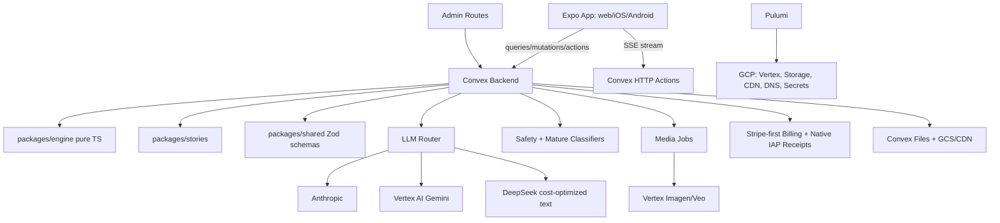
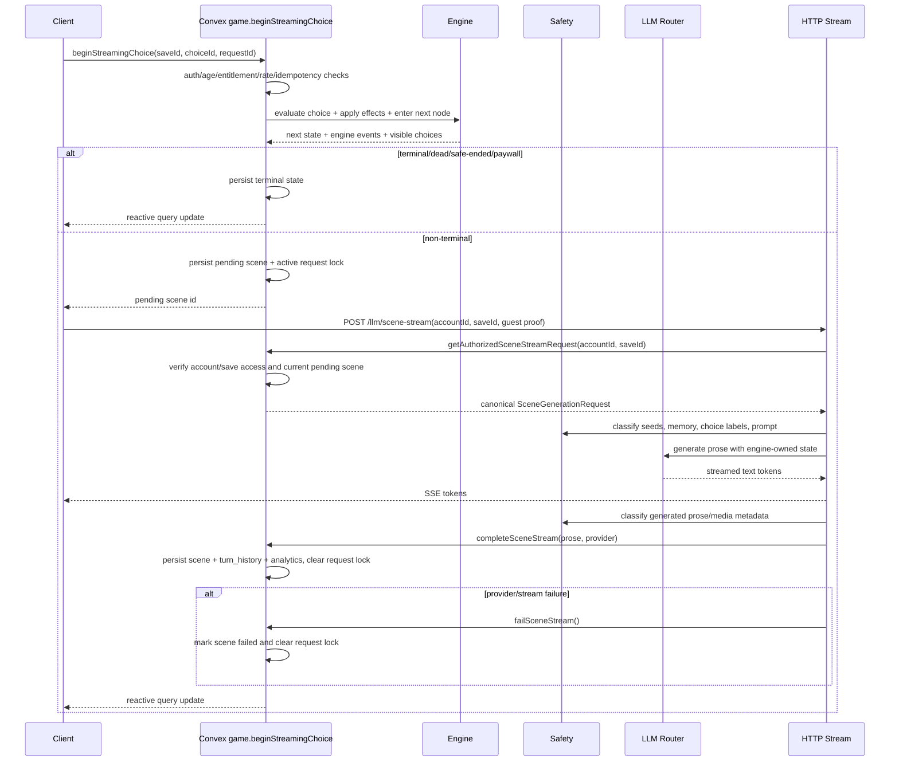

# Design Document - Core Read Loop / Full V1 App

## Overview

CYOA V1 is a guest-first, server-authoritative AI interactive-fiction app. The deterministic game engine owns all state transitions; Convex owns persistence, auth, billing, LLM orchestration, moderation, media jobs, analytics, and realtime synchronization; the Expo app renders a "living book" experience across web, iOS, and Android.

The product is designed as one coherent application rather than a demo loop. The initial path is still fast: age gate -> guest session -> tutorial -> reading view. Around that loop sit the app-critical surfaces: account claiming, daily-turn monetization, paid/pro entitlements, mature-content opt-in, co-op rooms, publishing and forking, creator seeds, seasons, endings map, trophy crypt, Pro media, native builds, operator dashboard, infrastructure, and save migrations.

Core invariants:

- The engine is pure TypeScript and has no I/O, React, Convex, LLM, billing, or provider imports.
- Convex is authoritative for every player-visible state transition.
- LLMs are content providers only; they never mutate stats, inventory, flags, nodes, endings, entitlements, age, or maturity settings.
- Safety gates run before prompting, before persistence, before publishing, and before rendering.
- Default content is general-audience. Mature content requires authenticated paid user, `ageBand = "18+"`, and explicit opt-in. Self-harm, suicide, depressive hopelessness, and player-directed despair are never allowed.
- The UI follows the design bundle's ink-on-parchment visual language, with `Read_Book` and `Stats_PeekDrawer` as defaults.

## Steering Document Alignment

### Technical Standards (tech.md)

- **TypeScript end-to-end:** Engine, shared schemas, Convex functions, Expo app, and Pulumi modules all use TypeScript.
- **Convex as reactive backend:** All saves, turns, rooms, entitlements, published tales, analytics, and assets live behind Convex queries/mutations/actions/HTTP actions.
- **Expo Router + React Native Web:** One client component tree serves web and native. Route groups map directly to `apps/app/app/*`.
- **Server-authoritative engine:** `packages/engine` computes conditions, choice application, auto-modifiers, delayed consequences, death routing, mode rules, and endings.
- **Provider router pattern:** `convex/llm/router.ts` hides Anthropic/Vertex/DeepSeek selection, fallback, retries, cost policy, and provider health.
- **Zod at trust boundaries:** Client args, LLM output, story data, generated media metadata, billing webhooks, env vars, and imported creator seeds are validated before use.
- **In-house analytics:** `analytics_events` is the only product analytics store. Admin dashboards read Convex aggregates; no third-party tracker scripts.
- **Stripe-first billing:** Stripe is the primary billing, customer portal, subscription, invoice, usage-meter, credit, and upgrade system. Native IAP is supported where app-store policy requires it and normalized into Convex entitlements.
- **Pulumi on GCP:** Infra owns Vertex AI, storage, CDN, DNS, Secret Manager, IAM, and monitoring.

### Project Structure (structure.md)

The design uses the documented monorepo layout:

- `packages/engine/`: pure game rules and executable Game Spec.
- `packages/stories/`: curated starter story data and seed fixtures.
- `packages/shared/`: Zod contracts, shared API types, analytics names, auth/env schemas, content policy schemas.
- `convex/`: server-authoritative app logic, data schema, LLM/media orchestration, auth, billing, co-op, publishing, analytics.
- `apps/app/`: Expo Router app with player, creator, account, paywall, admin, and native-compatible surfaces.
- `infra/`: Pulumi modules for GCP and deployment support.
- `design-bundle/`: reference-only design source. Production UI copies its visual language, not its prototype implementation.

## Code Reuse Analysis

### Existing Components to Leverage

- **Design bundle primitives:** `Btn`, `Choice`, `Chip`, `Bar`, `Portrait`, `Stamp`, `Divider`, `Icon`, `Img`, `Note` define the UI vocabulary. Production versions live under `apps/app/components/primitives/`.
- **Reading boards:** `Read_Book`, `Read_ModernApp`, `Read_GraphicNovel`, `Read_Journal`, `Read_Mobile` define the supported reading layouts.
- **Stats boards:** `Stats_Persistent`, `Stats_PeekDrawer`, `Stats_Contextual`, `Stats_FullSheet` define HUD modes.
- **Meta boards:** `Death_Brutal`, `Death_Bookish`, `Death_Cinematic`, endings web, trophy room, co-op lobby/turn/vote, paywall variants, and settings panel define route-level product surfaces.
- **Steering structure:** Route and module names in `structure.md` are used as target file ownership for implementation tasks.

### Integration Points

- **Convex schema:** Central integration point for accounts, saves, turns, entitlements, stories, published tales, co-op, assets, analytics, and migrations.
- **Engine package:** Convex imports engine public APIs only. Client imports engine types only.
- **Shared schemas:** `packages/shared/api` defines Convex argument/return contracts consumed by client and server tests.
- **BetterAuth:** Auth identity and account claiming integrate with Convex `accounts`.
- **Stripe/IAP:** Stripe webhooks are primary for web subscriptions, usage, credits, invoices, and plan changes. Native IAP receipts are normalized into Convex entitlements where required.
- **Anthropic/Vertex AI/DeepSeek:** Text providers are called only from Convex actions through the provider router. Vertex remains the media provider for Imagen/Veo.
- **Pulumi/GCP:** Secrets, Vertex service identity, web hosting, CDN, and monitoring are provisioned by infra.

## Architecture

### System Shape



### Turn Sequence



### Modular Design Principles

- **Engine modules are pure:** all randomness, clocks, and provider output are passed in by Convex.
- **Convex modules own one feature:** `turn.ts`, `saves.ts`, `account.ts`, `coop.ts`, `tales.ts`, `creator.ts`, `seasons.ts`, `analytics.ts`, `memory.ts`, `migrations.ts`.
- **Provider wrappers are isolated:** provider-specific SDK code lives in `convex/llm/*` and `convex/media/*`; rest of app calls internal router interfaces.
- **Client routes are thin:** route files wire hooks and layout; reusable behavior lives in `components/*`, `hooks/*`, and `lib/*`.
- **Shared schemas are explicit:** every cross-layer object has a Zod schema and inferred TS type.
- **Design tokens are centralized:** theme, typography, spacing, and semantic color tokens live in `apps/app/theme`.

## Components and Interfaces

### Engine Package

- **Purpose:** Execute Game Spec rules deterministically.
- **Files:** `packages/engine/src/types.ts`, `state.ts`, `apply.ts`, `visibility.ts`, `delayed.ts`, `death.ts`, `flags.ts`, `inventory.ts`, `stats.ts`, `modes.ts`, `endings.ts`, `migrations.ts`, `index.ts`.
- **Interfaces:**
  - `createInitialState(story, mode, now, rngSeed): PlayerState`
  - `evaluateConditions(state, choice): ChoiceVisibility`
  - `applyChoice(state, story, choiceId, ctx): EngineResult`
  - `enterNode(state, story, nodeId, ctx): EngineResult`
  - `resolveTerminal(state, story): TerminalResult | null`
  - `migrateEngineState(rawState): MigrationResult`
- **Dependencies:** Zod only, plus pure TS.
- **Reuses:** Game Specification Document from design bundle and steering.

### Stories Package

- **Purpose:** Provide curated starter adventures and test fixtures.
- **Files:** `packages/stories/training-room`, `bone-cathedral`, `iron-court`, `ashfall`, `index.ts`.
- **Interfaces:**
  - `getStory(storyId): Story`
  - `listStarterStories(): StorySummary[]`
  - `validateStory(story): StoryValidationResult`
- **Dependencies:** Engine story types and safety metadata schemas.
- **Reuses:** Gothic/candlelit tone and tutorial room structure from design bundle.

### Shared Package

- **Purpose:** Cross-layer contracts.
- **Files:** `packages/shared/api`, `analytics`, `auth`, `content`, `env`, `billing`.
- **Interfaces:**
  - API schemas for account, saves, turn, settings, co-op, tales, creator, seasons, admin.
  - `ContentPolicyResult`, `MatureContentPolicy`, `AgeBand`, `EntitlementTier`.
  - Analytics event name constants and payload schemas.
- **Dependencies:** Zod.

### Convex Schema and Data Access

- **Purpose:** Define app state and indexes.
- **Files:** `convex/schema.ts`, plus feature modules.
- **Interfaces:** Convex tables, indexes, typed queries, mutations, actions.
- **Dependencies:** Convex server APIs, shared schemas, engine, stories.

### Turn Orchestrator

- **Purpose:** Own the full read loop.
- **Files:** `convex/turn.ts`, `convex/http.ts`, `convex/memory.ts`, `convex/llm/*`, `convex/safety.ts`.
- **Interfaces:**
  - `turn.submit({ saveId, choiceId, requestId })`
  - `turn.current({ saveId })`
  - HTTP SSE endpoint for scene streaming, authenticated before any provider call
- **Responsibilities:** idempotency, locks, daily turns, age/mature gates, engine calls, safety classification, memory, LLM, persistence, analytics.

### LLM Provider Router

- **Purpose:** Select the right text provider by quality, latency, cost, safety support, content profile, and outage state without changing engine or client contracts.
- **Files:** `convex/llm/router.ts`, `anthropic.ts`, `vertex.ts`, `deepseek.ts`, `prompts/*`, `parse.ts`, `providerPolicy.ts`.
- **Interfaces:**
  - `llm.generateScene(request): AsyncIterable<TokenChunk>`
  - `llm.classify(request): Promise<ClassificationResult>`
  - `llm.summarize(request): Promise<SceneSummary>`
  - `llm.getProviderHealth(): ProviderHealth[]`
- **Provider roles:**
  - Anthropic: default quality-first long-form prose and sensitive narrative turns.
  - Vertex Gemini: independent fallback and some classification/summarization.
  - DeepSeek: cost-optimized text provider for eligible general-audience prose, summaries, retries, or low-risk continuations.
  - Deterministic: local fallback scene when all providers fail or content is blocked.
- **Prose budget:** `Story.defaultSceneLength` and `StoryNode.sceneLength` support `brief`, `standard`, `rich`, and `chapter`. The turn orchestrator resolves node override -> story default -> `standard` and includes it in `SceneGenerationRequest`; prompts translate this into concrete paragraph/word-count guidance while preserving engine-owned choices/state.
- **Gates:** Every provider output uses the same Zod parser, state-mutation rejection, safety classifier, mature-content classifier, logging redaction, and entitlement policy. A cheaper provider is never allowed to bypass quality or safety gates.
- **Routing signals:** story tier, player entitlement, mature-content setting, safety risk, provider health, latency SLO, cost budget, token estimate, retry count, and admin-controlled rollout percentage.

### Safety and Mature Content Gate

- **Purpose:** Block prohibited content and gate mature content.
- **Files:** `convex/safety.ts`, `convex/contentPolicy.ts`, `packages/shared/content/*`.
- **Interfaces:**
  - `classifyNarrativeSafety(input): SafetyResult`
  - `classifyMatureContent(input): MatureResult`
  - `assertContentAllowed(context, result): ContentDecision`
  - `buildSafeEnding(context): SafeEndingScene`
- **Rules:**
  - Self-harm, suicide, depressive hopelessness, and player-directed despair are blocked for everyone.
  - Adult language, adult subject matter, and adult imagery require paid authenticated `18+` opt-in.
  - Logs store metadata only by default.

### Account and Auth

- **Purpose:** Age-gated guest sessions and BetterAuth account claiming.
- **Files:** `convex/account.ts`, `convex/auth.config.ts`, `apps/app/app/account/*`, `apps/app/hooks/useAccount.ts`.
- **Interfaces:**
  - `game.createGuestAccount({ ageSelection, guestTokenHash })`
  - `game.listLibrary({ accountId, guestTokenHash? })`
  - `game.createSave({ accountId, guestTokenHash?, storyId, mode })`
  - `game.submitChoice({ accountId, guestTokenHash?, saveId, choiceId, requestId })`
  - `game.beginStreamingChoice({ accountId, guestTokenHash?, saveId, choiceId, requestId })`
  - `game.getAuthorizedSceneStreamRequest({ accountId, guestTokenHash?, saveId })`
  - `game.completeSceneStream({ accountId, guestTokenHash?, saveId, prose, provider })`
  - `game.failSceneStream({ accountId, guestTokenHash?, saveId })`
  - `account.claimGuest({ accountId, guestTokenHash?, userId })`
  - `account.exportAccount({ accountId, guestTokenHash? })`, `account.deleteAccount({ accountId, guestTokenHash?, confirm: "DELETE" })`
  - `account.updateMatureContent({ accountId, guestTokenHash?, enabled })`
- **Authorization model:** user-owned rows require BetterAuth `ctx.auth` identity matching `accounts.userId`; guest-owned rows require the opaque guest token proof matching `accounts.guestTokenHash`.
- **Dependencies:** BetterAuth, Convex auth, shared auth schemas.

### Billing and Entitlements

- **Purpose:** Stripe-first daily turn limits, Unlimited, Pro, credit packs, usage overages, and mature-content paid prerequisite.
- **Files:** `convex/billing/*`, `convex/ratelimit.ts`, `apps/app/app/paywall/*`.
- **Interfaces:**
  - `billing.getEntitlement()`
  - `billing.createCheckout()`
  - `billing.createCustomerPortalSession()`
  - `billing.recordMeterEvent()`
  - `billing.previewPlanChange()`
  - Stripe webhook HTTP actions
  - Native IAP receipt ingestion where required
  - `ratelimit.consumeTurn(accountId)`
- **Dependencies:** Stripe Billing, Stripe Checkout, Stripe Customer Portal, Stripe usage meters, StoreKit/Play Billing adapters where required, Convex HTTP actions.
- **Upgrade paths:**
  - Free -> Unlimited subscription.
  - Unlimited -> Pro subscription.
  - Pro -> Pro plus credit packs or metered overage opt-in for premium models, illustrations, video, or high-volume usage.
  - Monthly-to-annual and annual-to-monthly plan changes with Stripe preview/proration before confirmation.
  - Temporary top-up credits for extra turns or media without changing base plan.
- **Billing safety:** no surprise overages. Any billable usage beyond included allowance requires explicit opt-in, a visible usage meter, and a spend cap or threshold alert.

### Client UI Shell

- **Purpose:** Shared app providers and navigation.
- **Files:** `apps/app/app/_layout.tsx`, `apps/app/lib/convex.ts`, `apps/app/theme/*`.
- **Interfaces:** `ThemeProvider`, `AuthProvider`, `ConvexProvider`, route guards.
- **Design tokens:** parchment, ink, candle, night, day, sepia, typography stacks.

### Reader Components

- **Purpose:** Render scenes, choices, stats, streams, media, and endings.
- **Files:** `apps/app/components/reading/*`, `stats/*`, `choices/*`, `death/*`, `media/*`.
- **Interfaces:**
  - `ReadView({ saveId })`
  - `ProseStream({ sceneId })`
  - `ChoiceList({ choices, onSubmit })`
  - `StatsHud({ mode })`
  - `DeathScreen({ ending })`
  - `IllustrationFader`, `VeoCinematic`
- **Reuses:** `Read_Book`, `Read_Mobile`, `Read_GraphicNovel`, `Stats_PeekDrawer`, `Death_Brutal`.

### Product Routes

- **Purpose:** Route-level screens.
- **Files:** `apps/app/app/index.tsx`, `library`, `read/[saveId]`, `map/[saveId]`, `endings`, `settings`, `coop`, `tale/[taleId]`, `publish/[saveId]`, `creator`, `seasons`, `account`, `paywall`, `admin`.
- **Interfaces:** route params and Convex hooks.
- **Reuses:** design bundle boards by route.

### Co-op

- **Purpose:** Local and remote shared reading.
- **Files:** `convex/coop.ts`, `apps/app/components/coop/*`, `apps/app/app/coop/*`.
- **Interfaces:**
  - `coop.createRoom({ saveId, mode })`
  - `coop.joinRoom({ roomCode })`
  - `coop.vote({ roomId, choiceId })`
  - `coop.resolveTurn({ roomId })`
- **Reuses:** `CoopLobby`, `CoopTurn`, `CoopVote`.
- **Room mechanics:**
  - A room wraps a single authoritative save; participants subscribe to room and save projections.
  - Host owns room settings, participant removal, mode changes, and emergency close.
  - Pass mode gives one participant an active turn token; only that participant or host can submit.
  - Vote mode records one vote per participant per turn and resolves by majority, timeout, or host tie-break.
  - Read-only spectators may be allowed by host but cannot vote or submit choices.
- **Privacy constraints:**
  - Participants see display name/avatar/initial, presence, current room role, votes, and shared scene state only.
  - Participants do not see another participant's email, billing source, mature-content opt-in, private saves, unrelated endings, account settings, or analytics identifiers.
  - Mature rooms require every participant to be authenticated, paid, `18+`, and opted in; otherwise room content falls back to general-audience mode or blocks.

### Publishing, Forking, and Creator Seeds

- **Purpose:** Immutable tale snapshots, read-along, forking, creator-authored launches.
- **Files:** `convex/tales.ts`, `convex/creator.ts`, `apps/app/app/tale/[taleId]`, `publish/[saveId]`, `creator/*`.
- **Interfaces:**
  - `tales.publish(saveId, metadata)`
  - `tales.read(taleId)`
  - `tales.fork(taleId, turnId)`
  - `creatorFunctions.createDraft`, `creatorFunctions.publish`, `creatorFunctions.listPublishedMine`
  - `game.createSave({ storyId: "authored_seed:<seedId>" })`
- **Launch model:** starter stories are package-owned and validated by `seeds.loadStarterStories`; published account seeds are Convex-owned and become launchable library items with `authored_seed:<seedId>` story ids. Read queries and turn submission resolve that id back to the published seed story on the server.
- **Constraints:** mature and safety classification before publish and fork.

### Seasons and Achievements

- **Purpose:** Time-limited tales and leaderboards.
- **Files:** `convex/seasons.ts`, `apps/app/app/seasons/*`.
- **Interfaces:** `seasons.active`, `seasons.leaderboard`, `seasons.recordAchievement`.

### Operator Dashboard

- **Purpose:** Admin-only operational visibility.
- **Files:** `convex/analytics.ts`, `apps/app/app/admin/*`, `apps/app/components/admin/*`.
- **Interfaces:** funnel, cost, safety, live dashboards.
- **Constraints:** admin claim required; raw unsafe content redacted.

### Infrastructure

- **Purpose:** Repeatable deploy and environment management.
- **Files:** `infra/*`, `.github/workflows/*`.
- **Interfaces:** Pulumi stacks, GitHub Actions jobs, Convex deploy, Expo export/EAS update.

## Data Models

### Account

```ts
type Account = {
  _id: Id<"accounts">;
  kind: "guest" | "user";
  userId?: string;
  guestTokenHash?: string;
  ageBand: "13-17" | "18+";
  matureContentEnabled: boolean;
  matureContentEnabledAt?: number;
  createdAt: number;
  lastActiveAt: number;
  ttlExpiresAt?: number;
  isAdmin?: boolean;
};
```

### Entitlement

```ts
type Entitlement = {
  accountId: Id<"accounts">;
  stripeCustomerId?: string;
  stripeSubscriptionId?: string;
  tier: "free" | "unlimited" | "pro";
  source: "stripe" | "apple" | "google" | "manual";
  status: "active" | "grace" | "expired" | "revoked";
  includedTurnsPerDay?: number;
  includedPremiumTokens?: number;
  includedImages?: number;
  includedVideos?: number;
  overageOptIn: boolean;
  monthlySpendCapCents?: number;
  creditBalanceCents?: number;
  renewsAt?: number;
  updatedAt: number;
};
```

### Usage Meter

```ts
type UsageMeter = {
  _id: Id<"usage_meters">;
  accountId: Id<"accounts">;
  periodStart: number;
  periodEnd: number;
  textTokens: number;
  premiumTextTokens: number;
  imageGenerations: number;
  videoGenerations: number;
  stripeMeterEventIds: string[];
  estimatedCostCents: number;
  billableOverageCents: number;
  updatedAt: number;
};
```

### Save

```ts
type Save = {
  _id: Id<"saves">;
  accountId: Id<"accounts">;
  storyId: string;
  mode: "story" | "hardcore";
  status: "active" | "dead" | "ended" | "ended_safely";
  engineVersion: number;
  storyVersion: number;
  state: PlayerState;
  currentNodeId: string;
  currentSceneId?: Id<"scenes">;
  turnNumber: number;
  activeTurnRequestId?: string;
  createdAt: number;
  updatedAt: number;
};
```

### Scene

```ts
type Scene = {
  _id: Id<"scenes">;
  saveId: Id<"saves">;
  nodeId: string;
  turnNumber: number;
  stateFingerprint: string;
  prose: string;
  streamStatus: "pending" | "streaming" | "complete" | "failed" | "blocked";
  choiceViews: ChoiceView[];
  engineEvents: EngineEvent[];
  safety: ContentPolicySummary;
  provider?: "anthropic" | "vertex" | "deepseek" | "deterministic";
  createdAt: number;
  completedAt?: number;
};
```

### Turn History

```ts
type TurnHistory = {
  _id: Id<"turn_history">;
  saveId: Id<"saves">;
  accountId: Id<"accounts">;
  requestId: string;
  turnNumber: number;
  fromNodeId: string;
  choiceId: string;
  engineDiffs: EngineDiff[];
  engineEvents: EngineEvent[];
  provider: "anthropic" | "vertex" | "deepseek" | "deterministic";
  tokenUsage?: TokenUsage;
  latency: TurnLatency;
  createdAt: number;
};
```

### Story

```ts
type Story = {
  id: string;
  version: number;
  title: string;
  summary: string;
  tone: string;
  safetyProfile: "general" | "mature-allowed";
  startNodeId: string;
  initialState: PlayerStateSeed;
  nodes: Record<string, StoryNode>;
  endings: Record<string, EndingDefinition>;
  mediaPolicy: MediaPolicy;
};
```

### Published Tale

```ts
type PublishedTale = {
  _id: Id<"published_tales">;
  ownerAccountId: Id<"accounts">;
  sourceSaveId: Id<"saves">;
  title: string;
  synopsis: string;
  coverAssetId?: Id<"assets">;
  privacy: "public" | "unlisted" | "friends";
  accessRevokedAt?: number;
  forkPolicy: "any_decision" | "ending_only" | "disabled";
  isMature: boolean;
  safetySummary: ContentPolicySummary;
  snapshotTurnIds: Id<"turn_history">[];
  createdAt: number;
  updatedAt: number;
};
```

### Co-op Room

```ts
type CoopRoom = {
  _id: Id<"coop_rooms">;
  saveId: Id<"saves">;
  hostAccountId: Id<"accounts">;
  roomCode: string;
  inviteTokenHash: string;
  status: "open" | "active" | "closed";
  mode: "pass" | "vote";
  visibility: "private" | "link" | "friends";
  spectatorMode: "off" | "read_only";
  participants: CoopParticipant[];
  activeParticipantId?: string;
  voteEndsAt?: number;
  votes: Record<string, string>;
  createdAt: number;
  updatedAt: number;
};
```

### Coop Participant

```ts
type CoopParticipant = {
  participantId: string;
  accountId?: Id<"accounts">;
  guestTokenHash?: string;
  displayName: string;
  avatarInitial: string;
  role: "host" | "player" | "spectator";
  joinedAt: number;
  lastSeenAt: number;
};
```

### Asset

```ts
type Asset = {
  _id: Id<"assets">;
  accountId: Id<"accounts">;
  saveId?: Id<"saves">;
  taleId?: Id<"published_tales">;
  kind: "image" | "video" | "audio";
  provider: "vertex-imagen" | "vertex-veo" | "uploaded";
  url: string;
  status: "queued" | "generating" | "ready" | "failed" | "blocked";
  entitlementRequired: "pro";
  promptHash: string;
  provenance: object;
  safety: ContentPolicySummary;
  createdAt: number;
};
```

### Analytics Event

```ts
type AnalyticsEvent = {
  _id: Id<"analytics_events">;
  accountId?: Id<"accounts">;
  saveId?: Id<"saves">;
  eventName: string;
  storyId?: string;
  turnNumber?: number;
  payload: Record<string, unknown>;
  redacted: boolean;
  createdAt: number;
};
```

## UI Design System

### Tokens

Production tokens should mirror `design-bundle/project/sketch.css`:

- `paper`: parchment background.
- `paper2`: secondary parchment panels.
- `ink`: primary text/border.
- `inkSoft`: secondary text.
- `inkFaint`: tertiary text and hints.
- `inkGhost`: separators.
- `candle`: wax/candle accent.
- `candleSoft`: soft emphasis fill.
- `shadow`: restrained depth.

Typography:

- Classic headings: `IM Fell English` where available, fallback serif.
- Hand/body: `Patrick Hand` for story-adjacent UI, fallback readable system.
- Labels/stamps: `Special Elite` or monospace.
- User settings can switch prose font to Sans, Serif, or Mono.

### Production Primitive Mapping

- `Btn` -> `Button`
- `Choice` -> `ChoiceCard`
- `Chip` -> `Chip`
- `Bar` -> `ProgressBar`
- `Portrait` -> `Avatar`
- `Stamp` -> `Stamp`
- `Divider` -> `FlourishDivider`
- `Icon` -> `lucide-react-native` where available, with custom fallbacks for candle/book/skull.
- `Img` -> `MediaFrame`

### Route Surface Mapping

- Landing/library: `LandingClassic`, `LandingPicker`, `LibraryGrid`, `LibraryShelf`.
- Age gate: new modal/screen before landing CTA activation, styled as a bookplate.
- Reader: default `Read_Book`; mobile `Read_Mobile`; Pro `Read_GraphicNovel`; alternate settings `Read_ModernApp` and `Read_Journal`.
- Stats: default `Stats_PeekDrawer`; additional modes in settings.
- Death: default `Death_Brutal`; Pro/first-find can use cinematic treatment.
- Endings: `Endings_Web` and `Endings_TrophyRoom`.
- Co-op: `CoopLobby`, `CoopTurn`, `CoopVote`.
- Paywall: `PaywallSoft`, `PaywallInline`, `PaywallTopBar`.
- Settings: `SettingsPanel`.

## Error Handling

## Bug and Security Scrub

### Findings Addressed

1. **Billing source conflict**
   - Previous design said native-IAP-primary while the product direction is now Stripe-first.
   - Resolution: Stripe is primary for web checkout, subscriptions, invoices, customer portal, metered usage, credits, upgrades, and overage opt-in. Native IAP is a compatibility path where store policy requires it, normalized into Convex entitlements.

2. **Provider routing too narrow**
   - Previous design hard-coded Anthropic/Vertex and had no cost-optimized slot.
   - Resolution: provider router now has quality-first, fallback, cost-optimized, and deterministic slots. DeepSeek can serve cost-optimized eligible text only after passing identical parser, safety, mature, latency, and privacy gates.

3. **Co-op data leakage risk**
   - Previous design did not state what room participants can see.
   - Resolution: room projections expose only display name/avatar, role, presence, vote state, and shared scene state. Email, billing status, mature settings, private saves, unrelated endings, and analytics ids stay private.

4. **Mature co-op mismatch**
   - A single opted-in host could otherwise expose mature content to ineligible participants.
   - Resolution: mature co-op requires every participant to be authenticated, paid, `18+`, and opted in. Otherwise the room blocks or downgrades to general-audience content.

5. **Published tale revocation gap**
   - Previous design did not specify what happens to public URLs after privacy changes.
   - Resolution: unpublish/delete/private changes revoke public read and fork URLs immediately, while access-controlled records remain for owner export/deletion workflows.

6. **Analytics privacy gap**
   - Previous design redacted unsafe raw content but not all sensitive identifiers.
   - Resolution: analytics stores internal ids only and excludes email, OAuth profile fields, raw payment details, raw unsafe text, raw mature text, and private room invite URLs.

7. **Overage surprise risk**
   - Previous design did not define overage consent.
   - Resolution: no surprise overages. Extra premium usage requires explicit opt-in, visible usage meter, spend cap or threshold, and Stripe preview before plan changes.

### Security Controls

- Use opaque random guest tokens and room invite tokens; store hashes server-side.
- Scope every Convex query by account/guest/room membership.
- Return projected room participant records, never raw account rows.
- Validate all client args with Zod before database access.
- Authenticate SSE stream requests and authorize the requested account/save before any LLM provider call; the HTTP route must derive the provider request server-side from the current pending scene rather than trusting client-supplied seeds, choices, or prompt fields.
- Clear active turn locks on both stream completion and stream failure so provider errors cannot leave a save permanently stuck in a pending state.
- Verify Stripe webhook signatures and enforce idempotency on event ids.
- Verify native IAP receipts server-side before entitlement changes.
- Keep provider API keys and Stripe secrets in Convex env/GCP Secret Manager only.
- Never render model output as HTML.
- Redact safety/mature blocked text from logs and analytics by default.
- Require explicit mature-content entitlement checks on generation, media, publishing, forking, read-along, discovery, and co-op.
- Use idempotent request ids for turns, meter events, purchase callbacks, room votes, and publish actions.
- Enforce rate limits per guest/account/IP-ish environment signal where available, plus provider-cost budgets.

### Error Scenarios

1. **Age gate required**
   - **Handling:** Convex rejects save/turn mutations with `age_gate_required`.
   - **User Impact:** Client returns to age selector; under-13 receives non-game unavailable message.

2. **Mature content blocked**
   - **Handling:** Classifier blocks or rewrites content; logs redacted metadata; no detailed upsell copy.
   - **User Impact:** General-audience replacement or calm "the page turns away" redirection.

3. **Narrative safety trigger**
   - **Handling:** Stop stream if needed, discard unsafe completion, persist safe bridge or safe ending.
   - **User Impact:** In-world safe closure/redirection, no medical or alarmist copy.

4. **Duplicate turn submission**
   - **Handling:** Request id idempotency returns prior result; lock contention returns `turn_in_progress`.
   - **User Impact:** Choices stay disabled until reactive state updates.

5. **Provider parse failure**
   - **Handling:** Retry once, fallback provider, then deterministic scene.
   - **User Impact:** Story continues with in-world fallback prose.

6. **Daily turn exhausted**
   - **Handling:** Persist current scene, block next turn, show paywall.
   - **User Impact:** Book-metaphor daily limit screen with reset time and subscription options.

7. **Entitlement stale or webhook delayed**
   - **Handling:** Client polls/reactively watches entitlement; server remains source of truth.
   - **User Impact:** Temporary pending state; no double-charge path.

8. **Co-op host disconnect**
   - **Handling:** Preserve room; allow host recovery or transfer by rule.
   - **User Impact:** Participants see waiting/reconnect state.

9. **Co-op invite leaked**
   - **Handling:** Host can rotate invite token or close room; old token hash stops resolving.
   - **User Impact:** Existing participants remain if allowed; new joins require fresh link.

10. **Stripe overage threshold reached**
   - **Handling:** Pause billable premium generation until user confirms higher cap, buys credits, or downgrades model/media usage.
   - **User Impact:** Text reading continues where possible; premium feature waits for confirmation.

11. **DeepSeek unavailable or quality/safety gate fails**
   - **Handling:** Provider router marks provider degraded and routes to Anthropic/Vertex or deterministic fallback depending on turn risk.
   - **User Impact:** Story continues, possibly with higher internal cost or mild delay.

12. **Migration failure**
   - **Handling:** Original save remains unchanged; migration error logged redacted.
   - **User Impact:** Recoverable "this tale needs repair" state with retry/report.

13. **Media generation failure**
    - **Handling:** Mark asset failed; never block prose; optionally retry job.
    - **User Impact:** Text scene remains usable; media slot stays absent or shows quiet failure.

## Testing Strategy

### Unit Testing

- `packages/engine`: Vitest with >=95% coverage for apply, visibility, delayed, death, flags, inventory, stats, modes, endings, migrations.
- `packages/shared`: Zod schema tests for all API and content policy objects.
- `convex/safety.ts`: classifier decision matrix for self-harm, depressive, mature, general-audience, and redaction behavior.
- `convex/billing/*`: entitlement mapping from Stripe webhooks and native IAP receipt fixtures.
- Client primitives: render tests for `Button`, `ChoiceCard`, `StatsHud`, `ReadView` layouts, `DeathScreen`, `AgeGate`.

### Integration Testing

- Convex tests with mocked engine, LLM providers, Stripe, native IAP receipts, Vertex, Anthropic, and DeepSeek.
- Turn submission: success, death, delayed consequence, duplicate request, provider fallback, safety block, mature block.
- Account claiming: guest saves/endings/settings/tales move to BetterAuth account.
- Guest authorization: account-id-only access is invalid for guest rows; guest profile/library/save/turn/creator/export/delete and LLM stream checks require the guest token proof.
- Billing: daily turn decrement, paywall trigger, Stripe entitlement unlock, native entitlement normalization, Pro media unlock, credit packs, overage opt-in, plan changes, mature opt-in eligibility.
- Publishing/forking: immutable snapshot, privacy rules, mature blocking, fork state restoration.
- Co-op: room create/join, vote, pass mode, disconnect recovery, invite rotation, participant projection privacy, mature-room eligibility.
- Migrations: old save fixtures migrate atomically.

### End-to-End Testing

- First visit: age gate -> guest session -> tutorial start -> first choice -> stat pip.
- Under-13: blocked before session/save creation.
- Free limit: consume daily turns -> paywall -> subscribe mocked -> continue.
- Safety: generated unsafe content mocked -> safe bridge or safe ending.
- Mature gate: unpaid/under-18 blocked; paid 18+ opt-in allowed for mature category while self-harm remains blocked.
- Death: external-hazard ending -> trophy crypt -> begin again.
- Account claim: guest progress -> sign in -> reload on another device viewport.
- Co-op remote room: host + participant vote flow.
- Publish/read/fork: publish tale -> read-only view -> fork from decision.
- Pro media: text scene appears first, image/video attaches later.
- Admin: admin-only dashboard renders funnel/cost/safety/live metrics.

## Agent-Team Workstream Boundaries

The task phase should split work into disjoint ownership groups:

- **Engine team:** `packages/engine`, engine tests, story validation.
- **Content team:** `packages/stories`, starter adventures, safety-safe seeds.
- **Shared contracts team:** `packages/shared`.
- **Convex core team:** schema, saves, turn loop, migrations.
- **LLM/safety team:** provider router, prompts, parsing, safety/mature classifiers.
- **Client reader team:** primitives, theme, reader, stats, choices, death.
- **Product surfaces team:** library, settings, endings, paywall, account.
- **Co-op/publishing/creator team:** rooms, tales, forks, creator seeds.
- **Billing/media/native team:** Stripe entitlements, native IAP receipt normalization, media jobs, EAS.
- **Infra/admin team:** Pulumi, CI/CD, admin analytics.

Each implementation task should own a small file set, cite requirement ids, and log artifacts with the implementation-log tool after completion.

---

## Wave 0 — Hi-Fi Design Reconciliation (added)

A hi-fi design pass on top of the wireframes (`design-bundle/`) produced production-ready mockups, logos, icons, covers, and tokens. They live in the repo at `apps/app/assets/design/`. Below are the contract changes that supersede earlier sections of this document where they conflict.

### Token Reconciliation (canonical)

The "UI Design System → Tokens" section above lists primitives (`paper`, `paper2`, `ink`, `inkSoft`, `inkFaint`, `inkGhost`, `candle`, `candleSoft`, `shadow`). These remain valid as **alias tokens**, but production code MUST reference them by alias name only. The full alias layer is defined in `apps/app/assets/design/tokens/tokens.css` and `apps/app/assets/design/tokens/tokens.json`.

Additions to the alias layer:

| Alias        | Hex (sepia/parchment) | Use                                                                |
|--------------|-----------------------|--------------------------------------------------------------------|
| `paper3`   | `#ddd2bb`           | Tertiary parchment panels (peek-drawer, locked-choice fill)        |
| `danger`   | `#7a2218`           | **Reserved** — death, locked, paywall, mature opt-in only          |
| `success`  | `#3a5a3a`           | Stat gain pip, success ending stamp                                |
| `night`    | `#0c0d10`           | Night-theme surface (replaces `midnight`)                        |
| `day`      | `#fafaf7`           | Day-theme high-contrast accessibility surface                      |

**The Ember Rule.** `danger` (the deep-red ember, `#7a2218`) is the strongest accent in the system and MUST be reserved for death, locked choices, paywall, and mature opt-in. It is NEVER used for ambient gold accents or general emphasis. For ambient gold use `candle` (`#a87a1c`); for soft emphasis fills use `candleSoft`.

### Theme Set (canonical)

The wireframes named themes `parchment` and `midnight`. The canonical names are now:

| Canonical | Aliases (back-compat)  | Surface base | Notes                                  |
|-----------|------------------------|--------------|----------------------------------------|
| `sepia` | `parchment`          | `paper`    | Default reading theme                  |
| `night` | `midnight`           | `night`    | Low-light reading                      |
| `day`   | —                      | `day`      | High-contrast accessibility (new)      |

Requirement 18.1 ("Day, Night, and Sepia themes") already names these correctly. The token theme map in `apps/app/assets/design/tokens/tokens.json` resolves both aliases.

### Typography (canonical)

The wireframes used `IM Fell English`, `Patrick Hand`, and `Special Elite`. The canonical reader-side stack is:

- **Display** (chapter titles, ending names, death plate): `IM Fell English` → `EB Garamond` → serif fallback.
- **Reader serif** (default body): `Lora` → `EB Garamond` → serif fallback. Setting label: "Serif".
- **Reader sans** (accessibility): `Atkinson Hyperlegible` → `Inter` → system-ui. Setting label: "Sans".
- **Reader mono** (journal layout, code seeds): `JetBrains Mono` → ui-monospace. Setting label: "Mono".
- **UI / Stamps**: `Special Elite` for stamps, decorative; `Inter` for forms, controls, dashboards.
- **Hand** (`Patrick Hand`) is removed from production. The wireframes used it for sketch flavor; production uses Lora/EB Garamond.

### Asset References

The following shipped assets are referenced by the components in `apps/app/assets/design/design-system.html`. Implementation MUST lift them, not regenerate:

- **Logos** (`apps/app/assets/design/logos/`): `lockup-primary.svg`, `wordmark.svg`, `glyph-candle.svg` (favicon-source), `glyph-candle-light.svg`, `glyph-eye.svg` (mature-content stamp), `glyph-seal.svg` (publish stamp), `glyph-book-quill.svg` (creator stamp).
- **Icons** (`apps/app/assets/design/icons/`): 16 SVGs at `currentColor` — `candle`, `book`, `heart`, `coin`, `skull`, `eye`, `key`, `flame`, `compass`, `crown`, `hourglass`, `scroll`, `quill`, `sack`, `people`, `sparkle`. The "Production Primitive Mapping" line "Icon → `lucide-react-native` where available" is superseded — these 16 are the supported set; lucide is fallback only for icons NOT in this set.
- **Covers** (`apps/app/assets/design/covers/`): 560×800 SVG + PNG for `training-room`, `bone-cathedral`, `iron-court`, `ashfall`. Library cards (Requirement 26) MUST use these.
- **Marketing** (`apps/app/assets/design/marketing/`): `favicon.svg`, `favicon-{32,64,180,512}.png`, `og-card.{svg,png}` for social share.

### Hi-Fi Surface Coverage

`apps/app/assets/design/design-system.html` now renders production-fidelity versions of every surface named in this design doc. When implementing a route, open the canvas, find the section, and lift exact values from the JSX (do NOT take screenshots — the JSX is the source). The canvas has 25 sections; each is a `<DCSection id="…">` block near the bottom of the HTML.

| § id in canvas        | Title                       | Maps to design-doc / requirement                                          |
|-----------------------|-----------------------------|---------------------------------------------------------------------------|
| `foundations` (01)  | Foundations                 | UI Design System → Tokens, Typography                                     |
| `brand` (02)        | Brand (logos + icons)       | Asset References; Requirement 30.6, 30.8                                  |
| `components` (03)   | Components                  | Production Primitive Mapping (Btn, Choice, Chip, Bar, Stamp, etc.)        |
| `imagery` (04)      | Story covers / scene plates | Stories Package, Requirement 26.1                                         |
| `tiers` (05)        | Subscription tier crests    | Billing and Entitlements                                                  |
| `applied` (06)      | Landing / reading / OG card | Reader Components, OG marketing                                           |
| `themes` (07)       | Three paper stocks          | Requirement 18.1; Canonical Theme Set above                               |
| `enriched-flow` (08)| Shelf / seeding / settings  | Library (Req 26), Creator seeding, Settings (Req 18)                      |
| `journeys` (09)     | Four end-to-end flows       | Onboarding, seeding, settings, daily return                               |
| `auth` (10)         | Sign in / magic link / profile | Requirement 3 (auth)                                                    |
| `pricing` (11)      | Patronage & upgrade compare | Requirement 17 (entitlements + tiers)                                     |
| `chapter-end` (12)  | Consequence reel            | (new) between-chapter interstitial — see Requirement 19 / 6 consequences  |
| `discovery` (13)    | Discover & share modal      | Publishing/discovery surfaces (Req 22, 23)                                |
| `narrator` (14)     | Voice picker with waveform  | Requirement 24.4 (ambient/voice) and 24F continuity                       |
| `mobile` (15)       | Phone shelf + reading view  | Requirement 25.1 (Expo single tree on web/iOS/Android)                    |
| `states` (16)       | Toasts, empty, error        | NFR Usability + error surfaces                                            |
| `hifi` (17)         | Hero pitch-deck mockup      | Marketing reference only — not a production surface                       |
| `spec-gaps` (18)    | Age gate, under-13, mature opt-in, locked-choice copy, streaming placeholder | Requirements 1, 11, 12; streaming behavior (Req 5) |
| `reading-layouts` (19) | Mobile / GraphicNovel / ModernApp / Journal | Requirement 18.3 (Book / Modern App / Graphic Novel / Journal / Mobile) |
| `hud` (20)          | Stats HUD modes + pip motion| Requirement 6 (peek-drawer + 4 modes) and 18.4                            |
| `death-paywall` (21)| Three death + three paywall variants | Requirements 8 (death), 17 (paywall entry contexts)                |
| `coop` (22)         | Lobby / Turn / Vote         | Requirement 20                                                            |
| `endings` (23)      | Endings web + trophy crypt  | Requirement 19                                                            |
| `media-arch` (24)   | Imagen / Veo i2v / audio / journeys / narrator continuity | Requirement 24; MediaPlate Upgrade Pattern below |
| `operator` (25)     | Operator dashboard          | Requirement 27                                                            |

### MediaPlate Upgrade Pattern (clarification to Requirement 24)

The "Pro media" components have a four-state upgrade pattern that production MUST implement:

1. **Skeleton** — paper-textured frame with candle ornament + "the scene is being drawn…" while Imagen job queues.
2. **Image ready** — Imagen plate fades in (typical ≤3s); prose remains primary.
3. **Video buffering** — small corner pip indicates Veo is en route; image stays.
4. **Video playing** — crossfade to Veo loop; image kept as poster frame for reduced-motion fallback or Veo failure.

Reduced-motion preference (Requirement 18.5) → stay on state 2 (image) permanently, never advance to video. Veo failure → stay on state 2 and log to operator dashboard (Requirement 27.5).

### Source-of-Truth Hierarchy

1. `design.md` (this file) — product + visual contract.
2. `apps/app/assets/design/tokens/tokens.json` — exact color/font/spacing values.
3. `apps/app/assets/design/design-system.html` — reference rendering of (1) + (2).

If (3) drifts from (1) or (2), fix (3). Never promote a value to a token without team review.
